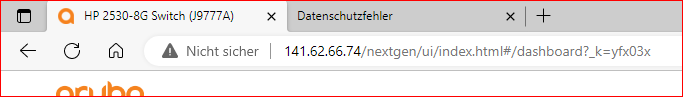

Grundsätzlich:
- Nur die konkreten Aufgaben werden in der PDF benötigt, nicht der komplette Anhang dazu
- Aufgaben die nicht bearbeitet wurden müssen nicht ins PDF, entsprechende Notiz dazu am Ende des Dokumentes

Formatierung:
- Aufgabenstellungen umgeben mit drei Backticks ```, z.B.:
```
a) Was für ein Dienst versteckt sich hinter 1.1.1.1?
```
- Lösungen zur Aufgabenstellung mit einfachem größer-als Symbol >, z.B.:
> Bei der IPV4 1.1.1.1 handelt es sich um einen Public DNS Service von Cloudflare.
- Umbrüche können immer mit \<br> erzwungen werden, in der Regel ist das aber nicht notwendig, für eine neue Zeile innerhalb von > kann einfach 
  eine Zeile freigelassen werden:
> Das ist eine Zeile.
> Das ist die gleiche Zeile.
> 
> Das ist eine neue Zeile.
- Wenn Code-Schnippsel oder Konfigurations-Anweisungen in eurer Antwort vorkommen, diese herausstellen mit einfachen backticks ``, z.B.:
> Um xy zu erreichen, muss `docker compose up` ausgeführt werden
- Bilder können eingefügt werden mit `` <br> Die eckigen Klammern am Anfang enthalten den 
  alternativen Text und können weggelassen werden, der Hover Text erscheint beim hovern mit der Maus über dem Bild und kann auch weggelassen werden,
  sofern es eine passende Bildunterschrift gibt
- Jedes Bild muss mit \*Abbildung X - Was passiert auf dem Bild?\* beschrieben werden
- **Hinter jedem Bild muss ein \<br> platziert werden, da es sonst die Formatierung zerschießt! Hinter der Bildunterschrift am besten auch nochmal.**
- Das Ganze sieht dann so aus:<br>
<br>
*Abbildung 1 - Zugriff auf das Webinterface über ungesicherten Port 80*<br>
- oder ohne Texte (siehe Markdown):<br>
<br>
*Abbildung 1 - Zugriff auf das Webinterface über ungesicherten Port 80*<br>
