<div style="page-break-after: always;">
<center>
<span style="font-size: 20pt">
Praktikum Rechnernetze SS23 <br>
Versuch 10: Sprachkommunikation (VOIP) <br>
Gruppe 4 <br>
</span>
<br>
<span style="font-size: 11pt">
Versuch durchgeführt: 27.06.2023 <br>
HdM Stuttgart<br><br>
Gruppe 4 Mitglieder:
 <br> Fabian Weber – fw072
 <br> Darius Patzner – dp047
 <br> Jonas Gehrung – jg175
 <br> Adib Shaqaiq – as448
 <br> Jonas Öhler – jo041
 <br>
 <br> Labor-PCs 141.62.66.9 und 141.62.66.10 wurden während dieses Versuchs benutzt
</span>
</center>

</div>

## Teil 1 - VoIP nach H.323 (H323Call File)

### Aufgabe 1

```
Das Capture-File zeigt die Abläufe zwischen zwei Rechnern im Labor Rechnernetze.
Welche H.323-Teilprotokolle und welche TCP- oder UDP-Sockets werden in welcher Phase wofür eingesetzt?
 - Verbindungsaufbau,
 - Datenübertragung und
 - Verbindungsabbau
```

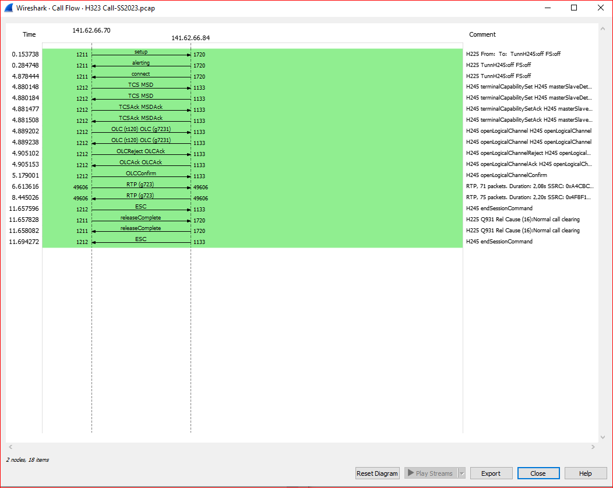
<br>
*Abbildung 1 - Flow Graph des H.323-Calls in Wireshark*
<br>

> 1. Verbindungsaufbau:
> * H.225.0: Wird während des Verbindungsaufbaus und Verbindungsabbaus eingesetzt und ermöglicht die Adressierung, Signalisierung und
    Übertragung von Steuerinformationen.
> * TCP-Sockets: Ein TCP-Socket wird für die Signalisierung der Verbindung über H.225.0 verwendet. Die Kommunikation erfolgt über den
    TCP-Port 1720 auf Server-Seite bzw. 1211 auf Client-Seite.
> 2. Datenübertragung:
> * H.245: Wird während der Datenübertragung verwendet und dient der Steuerung der Medienströme wie Audio und Video sowie der Verhandlung von
    Codecs. Es kann sowohl über TCP- als auch über UDP-Sockets verwendet werden, in dem gegebenen Beispiel wurde TCP (Port 1133 Server-Seite, Port
    1212 Client-Seite) genutzt.
> * RTP (Real-time Transport Protocol): RTP wird für die eigentliche Übertragung der Multimedia-Datenströme verwendet. Es baut auf UDP auf und
    verwendet dynamische UDP-Ports für unterschiedliche Datenströme. Im gegebenen Beispiel-Call wurde G.723.1 als Audiocodec für die Übertragung
    ausgehandelt.
> 3. Verbindungsabbau:
> * H.225.0: Während des Verbindungsabbaus wird H.225.0 erneut verwendet, zur Verbindungsabbauanfrage und letzten Endes zur Beendigung der Verbindung.
> * Für den Verbindungsabbau erfolgt die Kommunikation erneut über den TCP-Port 1720 bzw. 1211.

```
Eines der Teilprotokolle ist das Q.931. Wo wird dieses Protokoll ebenfalls verwendet?
```

> Das Q.931-Protokoll wird während dem Verbindungsaufbau und Verbindungsabbau eingesetzt, man findet es in den H.225.0-Paketen. Q.931 ist
> eigentlich ein ISDN-Protokoll (Integrated Services Digital Network), das der Steuerung von Verbindungen dient und allgemein in seinen Aufgaben
> dem H.225.0-Protokoll ähnelt.
>
> Während H.225.0 für die Signalisierung und Steuerung innerhalb eines IP-Netzwerks zuständig ist, ermöglicht Q.931 die Kommunikation mit
> ISDN-Netzwerken, Vermittlungsstellen und anderen Systemen, die auf Q.931 basieren. Die beiden Protokolle können also zusammenarbeiten, um die
> Signalisierung und Steuerung von H.323-Anrufen zu ermöglichen.

# Teil 2 - SIP-basierte VoIP-Kommunikation

## Aufgabe 1 - STUN

```
bei der Konfiguration des sipgate-Accounts sind auch Angaben zum sogenannten STUN-Server
erforderlich. Beschreiben Sie mit eigenen Worten Aufgaben und die Funktion eines STUN-Servers
```

> Ein STUN-Server (Session Traversal Utilities for NAT) hat die Aufgabe, die Kommunikation über das Internet zwischen Geräten zu erleichtern, die
> sich hinter einem NAT-Router (Network Address Translation) befinden und somit eine private, non-routable IP-Adresse besitzen.
>
> Die Hauptfunktionen eines STUN-Servers sind:
> * IP-Adresserkennung: Der STUN-Server ermittelt die öffentliche IP-Adresse eines Geräts, das sich hinter einem NAT
    befindet. Der Client kann die öffentliche IP-Adresse und einen nach außen offenen Port vom STUN-Server abfragen.
> * NAT-Traversierung: STUN-Server unterstützen Techniken zur Umgehung des NAT und zur Ermöglichung einer direkten Kommunikation zweier Geräte,
    was für Echtzeitkommunikation wie VOIP besonders wichtig ist.

```
Welche IP-Adresse hat das REGISTER-Paket nach dem NAT-Vorgang (NAT ist wegen der privaten Adresse
erforderlich)?
```

> Das REGISTER-Paket erhält die öffentliche IP-Adresse des Routers, der in diesem Netzwerk eingesetzt wird. Diese Adresse ist für uns aus dem
> Paket-Verlauf nicht einsehbar, da die NAT an den entsprechenden Stellen vom Router durchgeführt wird und wir darauf keinen Einfluss haben.

## Aufgabe 2 - Aufbau des Protokolls

```
Erstellen und dokumentieren Sie den „FlowGraph“ des vorliegenden Pakets und erläutern Sie kurz den
prinzipiellen Ablauf.
```

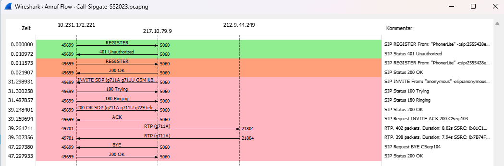
<br>
*Abbildung 2 - Flow Graph des SIPGATE-Calls in Wireshark*
<br>

> Die ersten vier Zeilen spiegeln den REGISTER-Ablauf wider.

> Der gesamte Ablauf:
> 1. Das VOIP-Gerät registriert sich per `SIP REGISTER` beim SIP-Server (`217.10.79.9`), in der Anfrage werden die SIP-Adresse des Clients, die
     Adresse des SIP-Servers und andere erforderliche Informationen angegeben. Der erste Versuch schlägt fehl, da das `Authorization`-Feld im
     Message Header fehlt.
> 2. Wenig später erhält das VOIP-Gerät einen `SIP INVITE` vom SIP-Server, also einen Anruf. Hier spielt SDP (Session Description Protocol) auch
     noch eine Rolle, das Paket enthält Informationen über z.B. die unterstützten Audio- und Videocodecs des Anrufenden.
> 3. Das Telefon mit der IP `10.231.172.221` bestätigt den Verbindungswunsch mit einem `100 Trying`, der Anrufprozess wurde also gestartet.
> 4. Mit `180 Ringing` wird dem SIP-Server mitgeteilt, dass das Telefon (`10.231.172.221`) klingelt.
> 5. Dann nimmt der Angerufene den Verbindungswunsch an, das Telefon schickt dem SIP-Server ein `200 OK`. In dieser Response
     werden auch die SDP-Verbindungsparameter des Empfängers mitgeschickt.
> 6. Der SIP-Server bestätigt dem Telefon den Verbindungsaufbau und die Verbindungsparameter mit einem `ACK` des Anrufenden.
> 7. Die beiden Gesprächspartner (IP-Anrufender Gesprächspartner `212.9.44.249`, IP-Angerufener Gesprächspartner `10.231.172.221`) können nun
     sprechen, der Austausch der Audiodaten erfolgt über einen RTP-Stream, der direkt zwischen den zwei Clients aufgebaut wird.
> 8. Der anrufende Gesprächspartner möchte die Sitzung nach einiger Zeit beenden und signalisiert dies mit einem `BYE-Request`.
> 9. Die Angerufene bestätigt die Beendigung mit einem `200 OK`, die Verbindung wird abgebaut.

## Aufgabe 3 - Registrierung bei Provider sipgate

```
Nach diesem typischen Ablauf ist der UAC beim Provider registriert.
```

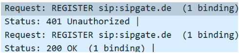

```
Warum wird die Anfrage zur Registrierung zunächst abgewiesen?
```

> Der Server meldet `401 Unauthorized`, eine Authentifizierung ist also zwingend erforderlich um Anfragen zu senden. Die Antwort enthält ein
> `WWW-Authenticate`-Header, in dem die erwünschte Art der Authentifizierung sowie der nonce-Wert (Number used ONCE) übermittelt wird.

```
Worin unterscheiden sich die beiden REGISTER-Pakete?
```

> Bei der ersten REGISTER-Anfrage fehlt der `Authorization`-Header, in dem erforderliche Daten für das Digest-Authentifizierungsschema des
> SIP-Servers übertragen werden. Das teilt der Server dem Client mit `401 Unauthorized` mit, bei der zweiten Request fehlt der Header nicht mehr
> und enthält den nonce-Wert aus der vorigen Response sowie die anderen erforderlichen Felder, der Server akzeptiert diese Registrierung dann.

```
Warum wird für die so wichtige Registrierung nicht TCP (garantiert die bitgetreue Zustellung) verwendet, sondern UDP?
```

> Die Gründe für die Verwendung von UDP statt TCP bei der Registrierung sind hauptsächlich Effizienz und Skalierbarkeit.
>
> Bei der SIP-Registrierung handelt es sich um ganz kurze Kontrollnachrichten, der große overhead von TCP wäre hier overkill und würde die
> Kommunikation unnötig verlangsamen.
>
> Da UDP keine Verbindung aufbaut, ist es einfacher, eine hohe Anzahl von SIP-Registrierungen zu verarbeiten. Für große SIP-Provider wie SIPGATE
> ist das von großer Wichtigkeit.
>
> Statt der 100% gesicherten Zustellung des REGISTER-Pakets kann der Client mit Timeout-Mechanismen arbeiten und damit das UDP-Paket so lange
> versenden, bis er eine Antwort erhält.

```
Wie lange ist die Registrierung gültig?
```

> Die Gültigkeitsdauer einer SIP-Registrierung wird durch das "Expires"-Feld im SIP REGISTER-Request oder in der entsprechenden Antwort des
> SIP-Servers festgelegt. In der Regel wird der Wert in Sekunden angegeben.
>
> In dem gegebenen Beispiel wurde das `Expires`-Feld auf 900 Sekunden gesetzt. Nach 15 Minuten müsste sich der Client also neu registrieren.

```
Die interne IP-Adresse des UA wird durch NAT in eine offizielle externe IP umgesetzt.
Wie lautet die externe IP und zu welchem Unternehmen gehört diese IP?
```

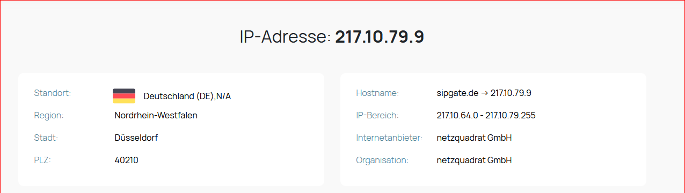
<br>
*Abbildung 3 - Externe IP des SIP-Servers mit WHOIS-Informationen*
<br>

> Der SIP-Server nutzt die IP-Adresse `217.10.79.9`, der Anrufende nutzt die IP-Adresse `212.9.44.249`. Beide IPs gehören zum Unternehmen
> `netzquadrat GmbH`, dem Betreiber von sipgate.

## Aufgabe 4 - Verbindungsaufbau

```
Es kommt ein Anruf von extern (INVITE, Zeile 5)
```

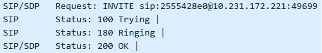

```
Welche SIP_Methods unterstützt der Anrufer?
```

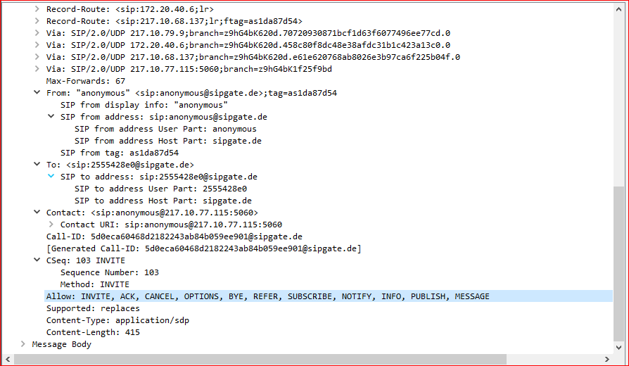
<br>
*Abbildung 4 - Unterstützte SIP-Methods des SIP-Servers*
<br>

> In der `INVITE-Request` gibt es ein Header `Allow`, der unterstützte SIP-Methods auflistet.
> In der Regel handelt es sich dabei aber um die unterstützten SIP-Methods des Servers, nicht des Anrufenden, es sei denn der SIP-Server ist
> dementsprechend konfiguriert.
> Die SIP Methods des Anrufenden können in diesem Fall mit einer `OPTIONS`-Anfrage ermittelt werden.

```
Welche Bedeutung haben Trying und Ringing?
```

> Der SIP-Statuscode `100 Trying` gibt an, dass der Angerufene den eingehenden INVITE-Request erhalten hat und dieser bearbeitet wird.
>
> Der SIP-Statuscode `180 Ringing` wiederum gibt an, dass das Gerät des Angerufenen benachrichtigt wird und somit aktiv ist. Der Anrufprozess ist
> also noch einen Schritt weiter im Vergleich zu `Trying`.

```
Welche Angabe bzgl. der Absender-Rufnummer erscheint auf dem Display des Empfängers?
```

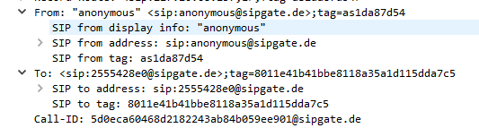
<br>
*Abbildung 5 - From und To Header im SIP-Paket*
<br>

> Informationen über den Absender (Anrufer) befinden sich im `From`-Header der SIP-Pakete.
>
> In dem gegebenen Beispiel ist der Absender `anonymous`. Es handelt sich also um einen Anrufer, der sich entweder nicht beim SIP-Server
> registriert hat, oder der gezielt seine Absender-Rufnummer unterdrückt.
>
> Das Display des Empfängers wird in diesem Fall vermutlich eine Meldung wie "Anonymer Anruf" o.ä. zeigen.

```
Der sehr lange „branch“-Wert ist eine Zufallszahl und identifiziert eindeutig eine SIP-Vermittlungsinstanz.
Berechnen Sie die Wahrscheinlichkeit, dass zwei SIP-Geräte einen identischen Wert erwürfeln (es zählen nur die
Angaben zwischen den beiden Punkten).
```

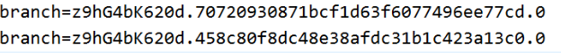

> Die `branch`-Strings bestehen aus lediglich hexadezimalen-Zeichen (16 Möglichkeiten, 0-9 und a-f) und sind immer 32 Zeichen lang.
> Die Wahrscheinlichkeit, dass nur zwei Stellen den gleichen Wert haben, lässt sich damit so berechnen:
>> `1/16 * 1/16 = 0,0039 = 0,39%`
>
> Dies müsste nun 32-mal auftreten, also:
>> `(1/16) ^ 32 ≈ 3 x 10^-39`
>
> Dies entspricht einer Wahrscheinlichkeit von quasi 0%, es ist also extrem unwahrscheinlich, dass zwei SIP-Geräte einen identischen Wert erwürfeln.

## Aufgabe 5 - Message Body: SDP-Protokoll

```
Beschreiben Sie Aufbau und Inhalt des Session Description Protokoll (SDP), insbesondere die verwendeten
Portnummern und das Audio-Video-Profile AVP, das die erlaubten Codecs in einer priorisierten Reihenfolge
angibt.
```

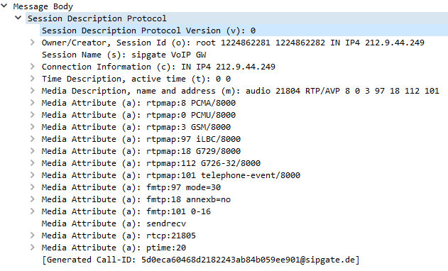
<br>
*Abbildung 6 - Aufbau SDP Protokoll*
<br>

> Das SDP ist in den Message-Body eines SIP-Pakets verpackt und ist immer gleich aufgebaut, es gibt Auskunft über den Ursprung, die Sitzungs- und
> Medienparameter sowie die unterstützten Codecs.
>
> Da die SDP-Informationen in ein SIP-Paket eingepackt sind, wird der normale SIP Port verwendet (5060 bzw. dynamisch auf Client-Seite).
>
> Das AVP gibt Aufschluss, was für ein Medientyp (z.B. audio) übertragen wird, auf welchem Port die Übertragung stattfinden wird, welches
> Protokoll zur Übertragung verwendet wird (z.B. RTP) und welche Codecs zur Verfügung stehen (absteigende Priorität).

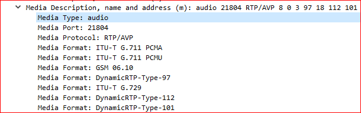
<br>
*Abbildung 7 - AVP des Anrufenden*
<br>

```
Welcher Sprach-Codec wird hier eingesetzt? Wir hoch ist die Bitrate dieses Codecs?
```

> Der Sprach-Codec `ITU-T G.711 PCMA` wird verwendet.
>
> Dieser Codec hat eine Sample Rate von `8kHz`, dies entspricht einer Bitrate von `64 KBit/s`.

## Aufgabe 6 - Analyse RTP/RTCP

```
Dokumentieren Sie den RTP-Kommunikationsfluss anhand der IP-Adressen.
Wer kommuniziert mit wem?
```

> IP-Adresse `10.231.172.221` (NAT) kommuniziert mit der IP-Adresse `212.9.44.249`.
> Die öffentliche IP-Adresse des Angerufenen können wir nicht einsehen, da sie vom Router per NAT immer wieder ausgetauscht wird.

```
wieviel „Audio-Samples“ (Abtastproben) enthält ein Ethernet-Paket? in welchen zeitlichen Abständen
werden die Pakete gesendet?
```

> Der ITU-T G.711 PCMA Codec hat eine Abtastfrequenz von `8 kHz`, was bedeutet, dass 8000 Samples pro Sekunde entstehen bzw. 8 pro ms.
> Jedes Sample wird in 8 bit verpackt, damit entstehen `8 * 8000 = 64 000 Bit/s`.
>
> Die Pakete werden ca. alle 20ms gesendet, dies entspricht 50 Paketen pro Sekunde. Damit muss jedes Paket `8 x 20 = 160` Audio-Samples enthalten.
> Man kann dies auch anhand des Timestamps erkennen.

```
welche Ethernet-Paketlänge wird übertragen? Warum fasst man nicht längere oder kürzere
Zeiträume zusammen?
```

> Aus der vorigen Aufgabe errechnet sich `160 * 8 = 1280 Bit` die jedes Ethernet-Paket mindestens groß sein müssen, tatsächlich sind sie
> 214 Byte (1712 Bit) groß (mit headern etc.).

> - Kürzere Zeiträume: Wenn man zu viele kleine Pakete mit einer sehr geringen Datenmenge sendet, führt das zu einer erheblichen Mehrbelastung des
    Netzwerks. Es handelt sich um einen optimierten Audio-Codec der auch unter schlechten Bedingungen verlässlich arbeiten soll, er sollte das
    Netzwerk nicht zu stark belasten.
> - Längere Zeiträume: Wenn die Pakete zu lange zusammengefasst würden, könnte dies zu einer höheren Latenz führen, da die Sprachdaten länger
    gesammelt werden müssten, bevor sie gesendet werden. Dies könnte zu Verzögerungen im Gespräch führen und die Echtzeitkommunikation
    beeinträchtigen.

```
Wie groß ist die Verzögerungszeit über das Verbindungsnetz?
```

> Wir senden ca. alle 20 Millisekunden ein Fragment, eine Antwort erhalten wir i.d.R. innerhalb von 7 ms.

```
Können Sie auch RTCP-Pakete erkennen? Wie häufig werden sie gesendet? Welchem Zweck dienen sie?
```

> RTCP-Pakete werden in regelmäßigen Intervallen gesendet (ca. alle 10 Sekunden bzw. 5 mit denen der Gegenseite), um Informationen über die Sitzung,
> die Übertragungsqualität und andere statistische Daten zu sammeln. Sie dienen der Optimierung der Medienqualität. Nimmt beispielweise die
> Übertragungsqualität ab, kann über RTCP eine höhere Komprimierung angesteuert werden.

```
welche Portnummern werden für die RTP-Verbindung verwendet, welche für die zugehörigen
RTCP-Kontrollkanäle (Wireshark: VoipCalls – SIPFlows - FlowSequence)
```

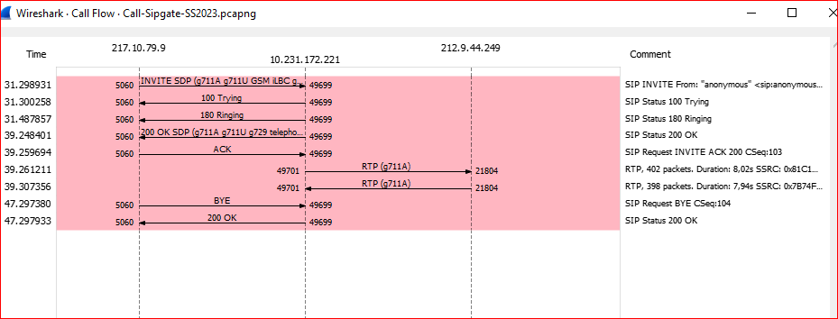
<br>
*Abbildung 8: Call Flow Wireshark*
<br>

> Für die RTP-Verbindung werden die (dynamischen) Ports 49701 auf Seite des Angerufenen und Port 21804 auf Seite des Anrufenden verwendet.
>
> Die zugehörigen RTCP-Kontrollkanäle nutzen immer den jeweiligen Port + 1, also 49702 auf der Seite des Angerufenen und 21805 auf Seite des
> Anrufenden.

## Aufgabe 7 - SIP-Bye

```
SIP verfügt über mehrere Timer zur Steuerung der Protokollabläufe. Im Beispiel sind zwei UA über eine
Leitung für Hin-und Rückrichtung miteinander verbunden. Die Leitung wird unterbrochen, der Empfänger
erhält kein Signal mehr und versucht, in seiner Senderichtung die Verbindung regulär abzubauen. Sendet
erkennt, dass , der das feststellt, versucht die Verbindung normal abzubauen (BYE-Method). Das geht
natürlich schief.
Beschreiben Sie, wie der BYE-Method-Timer arbeitet?
```

> SIP verwendet verschiedene Timer, um die Protokollabläufe zu steuern. Wenn beispielsweise keine Antwort auf eine SIP-Nachricht innerhalb eines
> bestimmten Zeitraums empfangen wird (z.B. ein Timer für die "200 OK"-Antwort auf eine BYE-Nachricht), wird versucht diese erneut einzufordern.
>
> Bei einem unbeantworteten BYE wird nach einer halben Sekunde erneut ein BYE-Paket gesendet, dann wird 3-mal verdoppelt also von 0.5s auf 1s,
> dann auf 2s und 4s. Der Timer von 4s wird dann noch 6-mal beibehalten, bevor die Verbindung endgültig aufgegeben wird. Wenn keine Antwort auf
> eines dieser Bye-Pakete erfolgt, wird das Senden der Bye-Pakete eingestellt, um die Verbindung nicht unnötig aufrechtzuerhalten. Dadurch soll
> vermieden werden, dass Ressourcen weiterhin für eine nicht mehr existierende Verbindung verwendet werden.

## Aufgabe 8 - Berechnung der VoIP-Übertragungsrate

```
Berechnen Sie die Bandbreite einer bidirektionalen VoIP-Verbindung (mit dem Codec G.711) mit den
angegebenen Zahlenwerten. Gehen Sie dabei davon aus, dass alle 20 ms ein Sprachpaket abgegeben
wird.
```

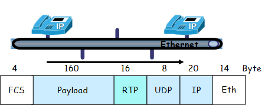

> Um die Bandbreite einer VoIP-Verbindung zu berechnen wird folgende Formel verwendet:
>> Gesamtgröße des Pakets in bits / Intervall in Sekunden
>
> also
>> ((4 + 160 + 16 + 8 + 20 + 14) * 8) / 0.02 = 88,8 KBit/s
>
> Da es sich um eine bidirektionale Verbindung handelt, muss man diesen Wert noch mal 2 nehmen, um die gesamte Netzwerklast zu berechnen.
> Dies wären dann `177,6 Kilobit / Sekunde` oder auch `0,1776 Megabit / Sekunde`, was immer noch sehr wenig ist.

# Da der WAN-Emulator nicht funktioniert hat, mussten wir die Analyse der gestörten VOIP-Verbindung weglassen.
