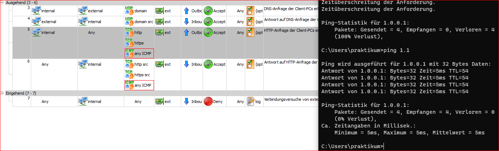
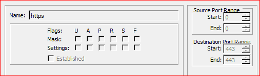
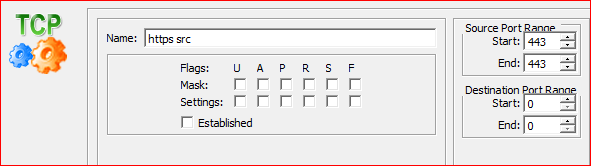
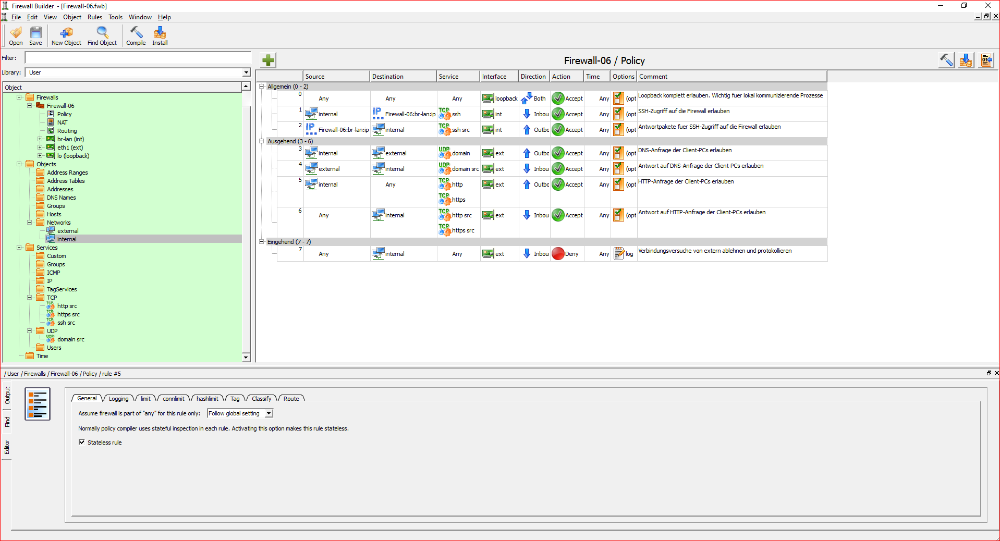
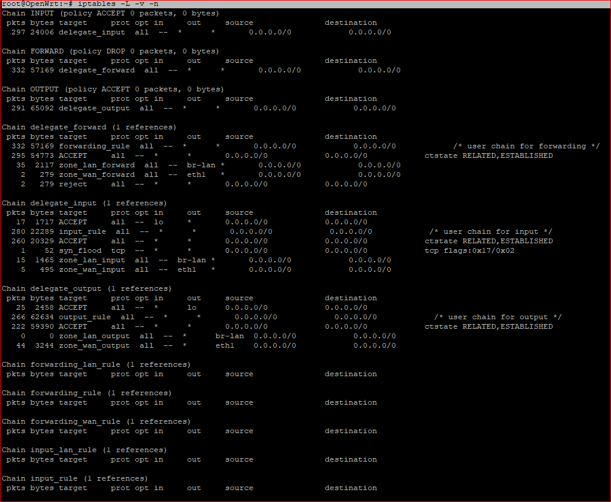
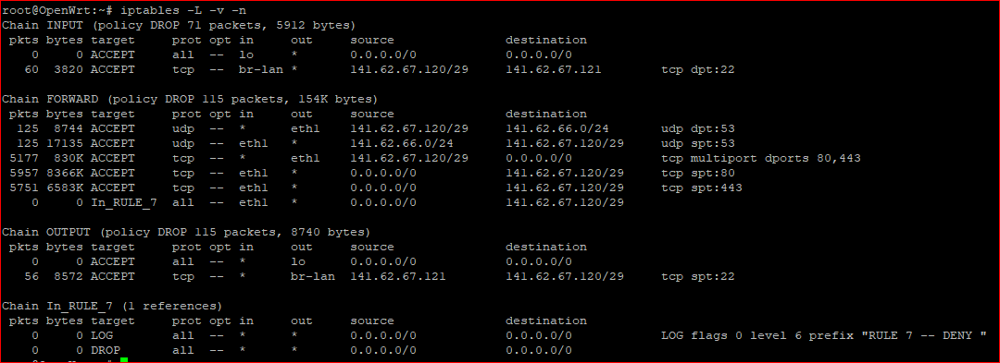
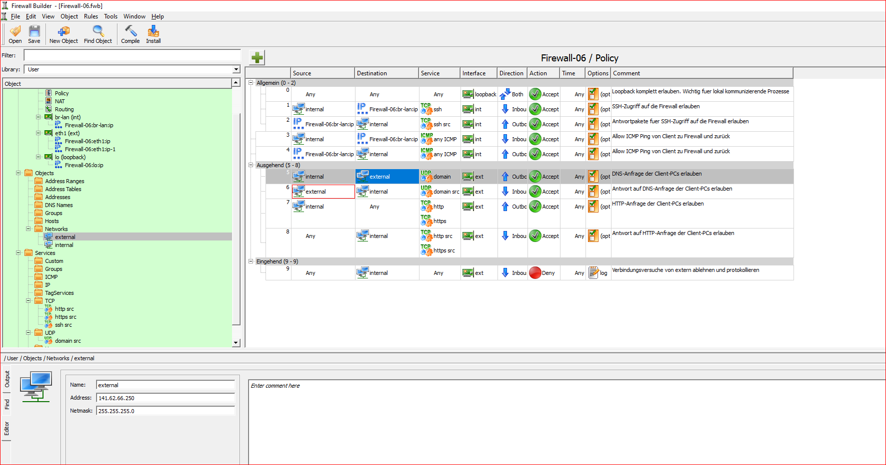

<div style="page-break-after: always;">
<center>
<span style="font-size: 20pt">
Praktikum Rechnernetze SS23 <br> Versuch 5: Firewall <br> Gruppe 4 <br>
</span>
<br>
<span style="font-size: 11pt">
Versuch durchgeführt: 02.05.2023 <br>
HdM Stuttgart<br><br>
Gruppe 4 Mitglieder:
 <br> Fabian Weber – fw072
 <br> Darius Patzner – dp047
 <br> Jonas Gehrung – jg175
 <br> Adib Shaqaiq – as448
 <br> Jonas Öhler – jo041
 <br>
 <br> Labor-PCs 141.62.66.9 und 141.62.66.10 wurden während dieses Versuchs benutzt
</span>
</center>

</div>

**1. Aufgabe:**

```
a) Verkabeln Sie Linux-Firewall und Client-PC, sodass der Client nur noch über die Linux-
Firewall mit unserem zentralen Switch verbunden ist. Die Beschriftung der Interfaces auf dem
Gerät sollte Ihnen dabei helfen.
```

> Dazu wird die Firewall über den WAN-Port an die Netzwerkdose angeschlossen, die zum zentralen Switch führt. Danach
> wird der Client-PC an einen
> der vier Ports der Firewall angeschlossen.

```
b) Konfigurieren Sie den Client-PC mit statischen Adressen , sodass
```

- die IP-Adresse passend zum Subnetz auf der Linux-Firewall gewählt ist, ein Gateway
  eingetragen wurde und die Clients das interne Interface der Linux-Firewall anpingen
  können;

> Der Client PC hat die IP-Adresse 141.62.67.122 bekommen. Als Gateway wurde die IP 141.62.67.121 eingetragen.
> <br>Über die Firewall steht ein /29-Netz zur Verfügung laut Sticker, in unserem Fall 141.62.67.120/29.
> <br>Ein Ping zur Firewall unter 141.62.67.121 war nach der statischen Konfiguration möglich.

- die Routing-Tabelle stimmt, d.h. als Standard-Gateway die IP-Adresse des internen
  Interfaces der Linux-Firewall eingestellt ist (ipconfig /all, route print);

> Als Default Route ist die IP des Gateways 141.62.67.121 eingetragen, es wird also jeglicher Traffic über die Firewall
> geschickt.

- die IP-Adresse des DNS-Servers stimmt (141.62.66.250).

> Als DNS wurde die IP des Labor-Routers eingetragen.

```
c) Überprüfen Sie ob Zugriff auf das Internet von der Firewall sowie vom Client aus möglich ist
```

- z.B. durch einen Ping auf 193.99.144.80 bzw. ix.de
- bzw. auf dem Client(s) durch den Aufruf einer Webseite Ihrer Wahl.

> Der Zugriff auf das Internet funktioniert vom Client und von der Firewall (test durch Ping und Website-Aufruf).

<hr>

**2. Aufgabe:**

> Standardmäßig waren nur HTTP und DNS requests ins Internet sowie SSH Verbindungen zur Firewall erlaubt, reine HTTP
> Seiten konnten also aufgerufen werden.
> Pings haben nicht funktioniert.

> Durch eine Regel haben wir ICMP requests (Ping) zur Firewall erlaubt.

<br>
*Abbildung 1 - Ping zur Firewall erlaubt*

> Dann haben wir zusätzlich auch ICMP requests ins Internet erlaubt. Dann war auch ein Ping an den public DNS-Server
> 1.0.0.1 möglich.

<br>
*Abbildung 2 - Ping ins Internet erlaubt*

Starten Sie den FW Builder indem Sie die auf dem Ilias bereitgestellte Konfigurationsdatei
herunterladen und öffnen. Es finden sich 10 verschiedene Konfigurationsdateien. Die zu Ihrer Box
passende Datei erkennen Sie am Dateinamen.
Ein Doppelklick auf den links in der Objektstruktur befindlichen Punkt ‚User -> Firewalls -> Firewall-xx
-> Policy‘ öffnet eine Liste mit Firewall-Regeln.

- Falls Sie unter Linux mit dem FWBuilder arbeiten, stellen Sie sicher, das bei geöffnetem
  Template die Option „ **-scp** “ unter den „ **Firewall Settings -> Reiter „Installer“ -> Additional**
  **command line... for scp** durch oKexAlgorithms=+diffie-hellman-group1-sha1 ersetzt
  wird.
  Ebenfalls bei „ **Additional comand line... for ssh** “ sollte diese Option eingefügt werden.
- Für eine ssh-Verbindung von Linux zur Firewall mithilfe der Shell ist ebenfalls eine Anpassung
  der Schlüsselaustauschmethode nach folgendem Schema nötig:
  ssh -oKexAlgorithms=+diffie-hellman-group1-sha1 root@141.62.67.xxx

### Warum sind diese Eingriffe eigentlich nötig?

> Dieser command setzt den Mechanismus zum Schlüsselaustausch mit dem SSH-Server auf den Diffie-Hellman Algorithmus bzw.
> setzt ihn als präferierten Algorithmus.
> Als Hashing Function wird SHA-1 verwendet.

> Diese Eingriffe sind nötig, da der SSH Server der Firewall vermutlich nur diesen Algorithmus unterstützt.
> Es ist aber anzumerken, dass dieser Algorithmus und auch die Hashing Function als legacy angesehen wird, und ein
> stärkerer Algorithmus zu empfehlen ist.

Machen Sie sich mit dem FW Builder vertraut und versuchen Sie dann eigene Regeln zu erstellen, **die
verschlüsselte Verbindungen vom Client-PC zu externen Webservern (HTTPS) erlauben**.

Ein paar Hinweise sind dafür sicher hilfreich:

- Für jeden freizugebenden Dienst muss explizit ein Regel-Paar erstellt werden, da zu jeder
  Verbindung immer eingehende und ausgehende Pakete gehören. Im FW Builder generiert
  vorerst stateless-Regeln. Zu den stateful-Regeln kommen wir später noch! **Achten Sie**
  **darauf, dass in den Optionen jeder Regel stateless eingestellt ist.**
- Es gibt zwei Objekt-Bibliotheken ( _User_ und _Standard_ ), in denen Sie jeweils verschiedene
  Objekte finden. Standard-Objekte sind z.B. das TCP Service Objekt ‚https‘. Ein dazu
  passendes ‚https src‘ Objekt müssen Sie dann aber selbst unter User-Objekte erstellen!
- Jede Regel kann zur Kontrolle einzeln generiert werden (Rechtsklick -> Compile Rule),
  um die Regel in der entsprechenden iptables-Syntax begutachten zu können.

> Die Regel für HTTPS Traffic wurde eingerichtet und hat funktioniert, wir konnten danach HTTPS-Verbindungen aufbauen.

<br>
*Abbildung 3 - HTTPS Destination Regel*

<br>
*Abbildung 4 - HTTPS Source Regel*

> Die HTTPS SRC Regel wurde von uns erstellt mit den entsprechenden Ports.

<br>
*Abbildung 5 - HTTPS Traffic erlaubt zusätzlich zu HTTP*

> Hier sieht man die HTTPS services hinzugefügt zu den bereits existierenden ACCEPT-Regeln, danach waren die
> Verbindungen möglich.

Bitte sehen Sie sich **vor und nach** Einspielen des Regelwerks auf der Firewall die Liste der aktiven
Regeln an (iptables -L -v -n)! Welche Default-Policy ist vor- bzw. nachher gesetzt? Sind zuvor bereits Regeln auf der
Firewall aktiv?

<br>
*Abbildung 6 - iptables command direkt nach Boot der Firewall*

> An den iptables Rules nach boot der Firewall (vor der Anwendung der FWBuilder Regeln) sieht man,
> dass standardmäßig jeglicher INPUT und OUTPUT traffic erlaubt wird, lediglich FORWARD traffic wird gedropt.

<br>
*Abbildung 7 - iptables command nach anwender der FWBuilder Regeln*

> Nach compilen und installen der FWBuilder Regeln sieht man, dass sich die default policy für die INPUT und OUTPUT
> Chain auf DROP geändert hat.
> Dafür wurden aber die entsprechenden Regeln eingefügt, die erlaubt werden sollen. In diesem Fall HTTP, HTTPS, DNS und
> SSH.

<hr>

**3. Aufgabe:**

**Wie unterscheiden sich stateless- und stateful-Firewalls? Beschreiben Sie kurz in eigenen Worten.**

> Eine stateless-Firewall ist eine grundlegende Paketfilter-Firewall, die vordefinierte Access-Listen verwendet, um
> Datenverkehr zu kontrollieren.
> Dabei werden nur statische Eigenschaften wie IP-Adresse, Protokolle oder Port-Nummer des Absenders oder Empfängers
> berücksichtigt.
> Im Gegensatz dazu hat eine stateful-Firewall ein "Gedächtnis" und kann erkennen, ob eingehende Pakete zu einer bereits
> etablierten Verbindung gehören wie z.B. TCP-Sitzungen.
> Auch eine stateful Firewall kann natürlich vordefinierte Regeln zur Behandlung haben, wenn ein Paket z.B. keiner
> etablierten Verbindung zugeordnet werden kann.

**Um mit dem FW Builder stateful-Regeln generieren zu lassen, sind folgende Schritte notwendig:**

- **Firewall Settings -> “Accept ESTABLISHED and RELATED packets before the first rule”**
  **Was bewirkt diese Einstellung wohl? Kurze Erläuterung!**

> Die Firewall kann durch die Einstellung "Accept ESTABLISHED and RELATED packets before the first rule" bereits
> aufgebaute Verbindungen und deren Zustände speichern.
> Wenn ein neues Paket eingeht, wird zunächst geprüft, ob es zu einer bereits bestehenden Verbindung gehört.
> Wenn das der Fall ist, wird das Paket angenommen. Nur wenn das Paket keiner Verbindung zugeordnet werden kann, wird
> die Filterkette durchlaufen.
> Wird ein Paket also als RELATED oder ESTABlISHED erkannt (z.B. TCP-Session), wird es durchgelassen, bevor irgendwelche
> Regeln der Firewall angewendet werden.
> Mit dieser Einstellung können bestimmte Regeln, die das Erlauben von Antworten auf zuvor gesendete Anfragen
> beinhalten, obsolet werden,
> da jede Anfrage als begonnene Verbindung gespeichert wird.

- **Löschen der Regeln, die durch diese Einstellung obsolet geworden sind.**
  **Welche Regeln werden aufgrund der obigen Einstellung im Regelwerk nicht mehr benötigt?**
  **Kurze Erläuterung!**

> Durch die Verwendung von Outbound-Regeln wird der Zustand einer Verbindung erstellt und somit werden eingehende
> Antworten des Servers automatisch durchgelassen,
> da sie als ESTABLISHED oder RELATED erkannt werden. Aus diesem Grund sind Inbound-Regeln nicht mehr notwendig.

- **In den Optionen der Regeln das Häkchen bei ‚stateless rule‘ entfernen.**
  **Vergleichen Sie die jeweils generierten iptables-Befehle (Rechtsklick auf eine Regel -> Compile**
  **Rule). Wie unterscheiden sich diese?**

> Der iptables Befehl mit "stateless rule" sieht wie folgt aus:

> `IPTABLES -A FORWARD -o eth1 -p tcp -m tcp -s 141.62.67.120/29 -dport 443 -j ACCEPT`

> Aktiviert man hingegen eine "stateful rule", sieht er wie folgt aus:

> `IPTABLES -A FORWARD -o eth1 -p tcp -m tcp -s 141.62.67.120/29 -dport 443 -m state --state NEW -j ACCEPT`

> Der Befehl wurde durch die Hinzufügung der Parameter "-m state --state NEW" erweitert. Mit diesem Parameter werden
> Pakete zugelassen, die ihm NEW state sind (Start einer Netzwerkverbindung, z.B. TCP Handshake). Durch das vorige
> setzen
> von `Accept ESTABLISHED and RELATED packets before the first rule` werden auch die darauf folgenden Pakete, die keinen
> NEW state mehr haben, zugelassen, da sie RELATED oder ESTABLISHED sind.

**Verändern und erweitern Sie das Regelwerk nun um einige Regeln und testen Sie diese:**

- **Zur Fehlersuche im eigenen Netzwerk ist es meist gut, wenn die Firewall auf Ping antwortet.**
  **Erlauben Sie ICMP Pakete vom Netz des Client-PCs zur Firewall.**

> siehe Abbildung 1

> Alternativ lässt sich diese Anforderung auch durch eine einzige "stateful" Regel realisieren (nur Inbound)

- **Schränken Sie die Regel für DNS-Anfragen von Client PCs so ein, dass nur noch Anfragen an**
  **unseren DNS-Server im Labor (141.62.66.250) erlaubt sind.**

> Um sicherzustellen, dass unsere Client-PCs nur den DNS-Server im Labor nutzen können, müssen wir eine Regel in unserer
> Firewall erstellen. Diese Regel erlaubt nur DNS-Verkehr von den Client-PCs an die IP-Adresse des Labor-DNS-Servers (
> 141.62.66.250).

> Dazu müssen wir die Quell-IP-Adresse als das Subnetz unserer Client-PCs (z.B. 141.62.67.120/29) und die
> Ziel-IP-Adresse
> als die IP-Adresse des Labor-DNS-Servers (141.62.66.250) angeben. Wir können "UDP" und "TCP" als Protokoll (DNS nutzt
> i.d.R. UDP) verwenden
> und den Service auf "DNS" (Port 53) einstellen.
> Vor unserer Änderung waren DNS-Pakete an das gesamte 141.62.66.0 Netz erlaubt, nach unserer Regel nur noch an
> 141.62.66.250.

> Durch diese Regel stellen wir sicher, dass unsere Client-PCs nur den Labor-DNS-Server nutzen und andere DNS-Server
> nicht erreichbar sind.

<br>
*Abbildung 8 - DNS-Requests nur an Labor-Router erlaubt*

<hr>

**4. Aufgabe:**

Als Administrator einer Firewall ist es extrem wichtig, nicht nur das GUI-Werkzeug zu beherrschen,
sondern auch die generierten Regeln nachvollziehen zu können. Nur wer die Architektur und Syntax
von iptables durchschaut hat, kann auch beurteilen, ob das generierte Regelwerk wunschgemäß erstellt
wurde.

Angenommen unser DNS-Server im Labor wäre temporär nicht verfügbar. Da wir davon
ausgehen, dass er bald wieder funktioniert, wäre eine Änderung im FW Builder wenig sinnvoll.
Gehen Sie daher wie folgt vor: Löschen Sie die entsprechende Regel aus dem aktiven
Regelwerk der Firewall (die Option --line-numbers beim Anzeigen der Regeln ist für das
Löschen sehr hilfreich). Fügen Sie anschließend ebenfalls direkt auf der Firewall eine Regel
ein, die DNS-Anfragen an jegliche Server im Internet erlaubt.

<br>
*Abbildung 9 - Manuelles löschen der iptables Regel 3*

> Wir haben die dritte Regel aus der Forward chain gelöscht, eigentlich wollten wir Regel 2 löschen.
> Regel 2 wäre für den DNS-traffic verantwortlich gewesen, stattdessen haben wir mit Löschen der Regel 3 den HTTP und
> HTTPS Traffic ins Internet verboten 😁<br>
> Wir haben im Nachhinein auch noch die richtige Regel gelöscht, davon aber keinen Screenshot mehr gemacht.
> Nach Löschen der richtigen Regel waren keine DNS-requests mehr möglich, auch nicht an den Labor-Router.

> Um DNS-traffic ins Internet zuzulassen, haben wir die folgenden Befehle verwendet:

`iptables -A FORWARD -i eth1 -p udp -m udp --sport 53 -d 0.0.0.0/0 -j ACCEPT`<br>
`iptables -A FORWARD -o eth1 -p udp -m udp -s 141.62.67.120/29 --dport 53 -j ACCEPT`

> Mit diesen Regeln werden alle UDP Verbindungen auf Port 53 (DNS) die aus dem Subnetz unserer Firewall kommen an
> jegliche Zieladresse zugelassen. Eine Verbindung zu einem beliebigen DNS-Server im Internet ist somit möglich.

## Aus Zeitgründen konnten wir den Rest der Aufgaben leider nicht bearbeiten.
## Leider mussten wir nach langem probieren an Aufgabe 2 auch von Linux auf Windows wechseln, da der FWBuilder trotz korrektem setzen des SSH Key Exchange Algorithms nicht funktioniert hat.
