<div style="page-break-after: always; text-align: center;">
<span style="font-size: 20pt">
Praktikum Rechnernetze SS23 <br> Versuch 6: DNS <br> Gruppe 4 <br>
</span>
<br>
<span style="font-size: 11pt">
Versuch durchgeführt: 09.05.2023 <br>
HdM Stuttgart<br><br>
Gruppe 4 Mitglieder:
 <br> Fabian Weber – fw072
 <br> Darius Patzner – dp047
 <br> Jonas Gehrung – jg175
 <br> Adib Shaqaiq – as448
 <br> Jonas Öhler – jo041
 <br>
 <br> Labor-PCs 141.62.66.9 und 141.62.66.10 wurden während dieses Versuchs benutzt
</span>
</div>

# Aufgabe 1

```
a) Nutzen Sie den Befehl dig um einen Überblick über die TLDs zu bekommen.
Wie viele Nameserver verwalten z.B. die de.-Domains?
```

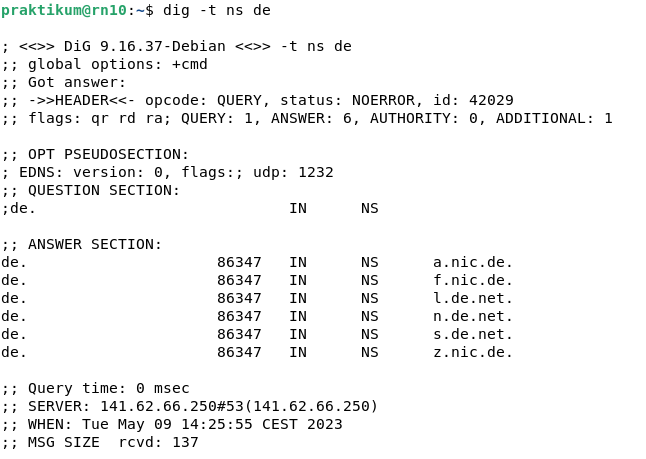
<br>
*Abbildung 1 - Auflistung der autoritativen Nameserver der TLD ".de"*
> Nach dem Ausführen des Befehls "dig -t ns de" erhält man eine Auflistung aller
> autoritativen Nameserver, welche für die Namensauflösung der TLD (Top level Domain) ".de" verantwortlich sind.
> Hier sind insgesamt sechs Server aufgelistet, sie bilden die höchste Instanz in der Kette der Namensauflösung und speichern die tatsächlichen
> Einträge.

```
b) Erkennen Sie Besonderheiten bei der TLD .ir?
```

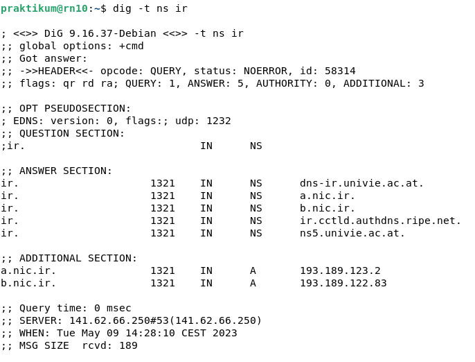
<br>
*Abbildung 2 - Besonderheiten bei der TLD ".ir"*
> Nach dem Ausführen des Befehls "dig -t ns ir" fällt auf, dass als DNS-Server auch
> einige Server mit österreichischer TLD eingetragen sind.
> Das deutet darauf hin, dass die Infrastruktur des Iran nicht stabil genug ist um den Dienst dauerhaft bereitzustellen,
> scheinbar wurde die Leistung hier also mit Hilfe ausländischer Unterstützung aufgebaut.

```
c) Schauen sie sich mit dig ein paar weitere für das Internet „exotische“ Länder an.
```

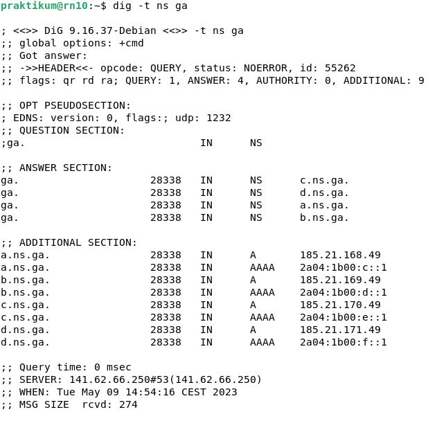
<br>
*Abbildung 3 - Untersuchung von der TLD ".ga"*
> Das Land Gabun hat vier autoritative Nameserver.
> Hinzu kommt noch, dass in der Additional Section zu allen Nameservern direkt die IPV4 und IPV6 Adresse eingetragen ist.

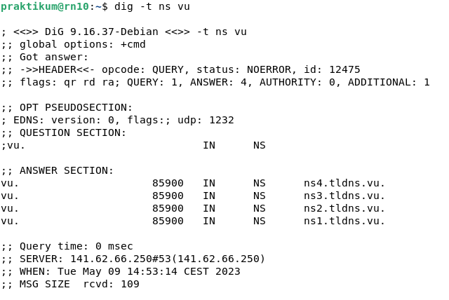
<br>
*Abbildung 4 - Untersuchung der autoritativen Nameserver der TLD ".vu"*
> Bei der Untersuchung der autoritativen Server der TLD von Vanuatu (.vu) sind ebenfalls vier Server zu finden, allerdings gibt es hier keine Einträge
> in der additional section.

```
d) Welche Mailserver werden von der Domain hdm-stuttgart.de verwaltet?
```

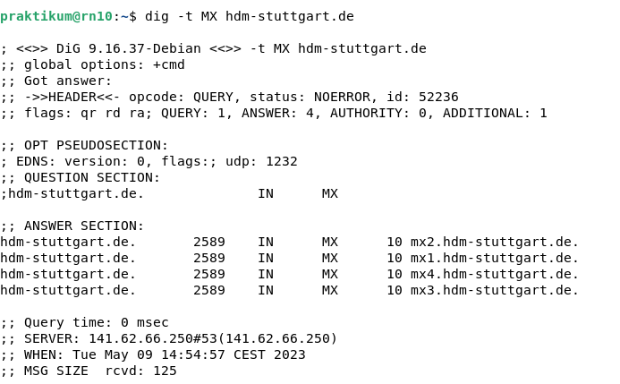
<br>
*Abbildung 5 - Auflistung der Mailserver der Domain hdm-stuttgart.de*
> Durch Ausführen des Commands "dig -t MX hdm-stuttgart.de" erhält man eine
> Auflistung aller Mailserver der Domain hdm-stuttgart.de. Diese sind:
> * mx1.hdm-stuttgart.de
> * mx2.hdm-stuttgart.de
> * mx3.hdm-stuttgart.de
> * mx4.hdm-stuttgart.de

```
e) Wieveile Nameserver werden in der Domain hdm-stuttgart.de und der Domain
mi.hdm-stuttgart.de administriert und wie lauten sie und welche IPs haben sie?
```

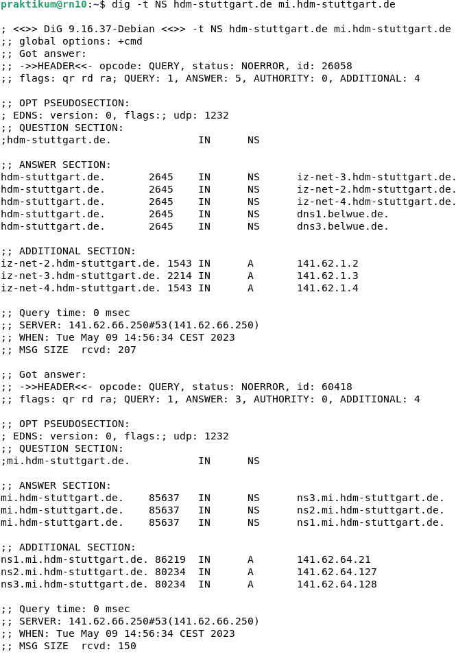
<br>
*Abbildung 6 - Auflistung der Nameserver der Domain hdm-stuttgart.de*
> Durch Eingabe des Commands "dig -t NS hdm-stuttgart.de mi.hdm-stuttgart.de" erhält man
> eine Auflistung der autoritativen Nameserver sowohl von der Domain hdm-stuttgart.de
> als auch von der Domain mi.hdm-stuttgart.de. Bei der Domain hdm-stuttgart.de sind insgesamt
> 5 Nameserver gelistet. Die HDM scheint sowohl eigene autoritative Nameserver zu betreiben, als auch die des Landeshochschulnetzes BELWUE zu nutzen.
> Die Nameserver und deren IPs lauten:

| Nameserver                | IP Adressen |
|---------------------------|-------------|
| iz-net-2.hdm-stuttgart.de | 141.62.1.2  |
| iz-net-3.hdm-stuttgart.de | 141.62.1.3  |
| iz-net-4.hdm-stuttgart.de | 141.62.1.2  |
| dns1.belwue.de            | keine IP    |
| dns3.belwue.de            | keine IP    |

*Tabelle 1 - Auflistung aller Nameserver*

> Bei den DNS-Servern von belwue wurden keine IP adressen angegeben, vermutlich weil sie nicht selbstverwaltet sind.
> Beim Ausführen des Commands wurde auch eine Auflistung der DNS-Server für die Domain mi.hdm-stuttgart.de erzeugt.
> Insgesamt sind hier drei Nameserver gelistet:

| Namserver               | IP Adressen   |
|-------------------------|---------------|
| ns1.mi.hdm-stuttgart.de | 141.62.64.21  |
| ns2.mi.hdm-stuttgart.de | 141.62.64.127 |
| ns3.mi.hdm-stuttgart.de | 141.62.64.128 |

*Tabelle 2 - Auflistung der autoritativen Nameserver für die Domain mi.hdm-stuttgart.de*

> Für alle Nameserver finden sich hier die zugehören IPV4-Adressen in der additional section als A-Record.

# Aufgabe 2 Installation/Konfiguration

In dieser Aufgabe geht es um die Installation und Konfiguration des BIND-Servers.

```
a) Installieren Sie bind9 auf ihrem in Debian gebooteten Client. Am einfachsten lässt sich das
mit
su root
erledigen.

Zunächst bringen Sie Debian mit Updates auf den neuesten Stand.

Im Folgenden erfolgt die Installation mit:
apt install bind9 bind9utils bind9-doc dnsutils
Damit wird alles Nötige unter /etc/bind installiert.
```

> Installation hat geklappt, unter /etc/bind finden sich Konfigurationsdateien.

```
b) Erläutern Sie kurz den Sinn der verschiedenen Dateien in diesem Verzeichnis.
```

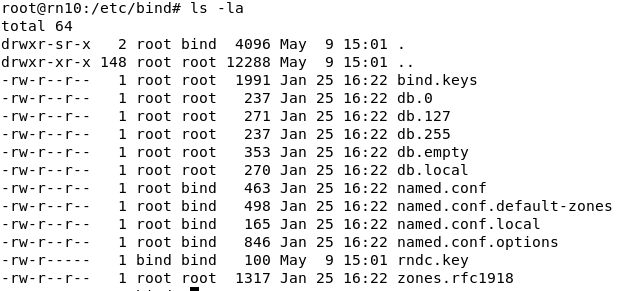
<br>
*Abbildung 7 - Auflistung der Bind Config Dateien frisch nach Installation*
> * named.conf: Ist die Hauptkonfigurationsdatei des BIND-DNS-Servers. Sie enthält globale Einstellungen sowie Referenzen zu anderen Config-Files.
> * named.conf.options: Enthält globale Optionen und Einstellungen für den BIND-DNS-Server wie z.B. die IP-Adressen und Schnittstellen, auf denen der
    Server listened, sowie Logging-Einstellungen, Einstellungen zur Weiterleitung von
    > Anfragen usw.
> * named.conf.local: In dieser Datei werden die lokalen Konfigurationen für die DNS-Zonen definiert. Hier können neue DNS-Zonen hinzufügt oder
    bestehende Zonen konfiguriert werden. Jede Zone hat bestimmte benötigte Angaben.
> * named.conf.default-zones: Diese Datei enthält die Standard-DNS-Zonenkonfigurationen für bestimmte häufig verwendete Zonen. Hier werden
    grundlegende DNS-Zonen wie die Localhost-Zonen und die Root-Hints-Zone definiert.
> * db.local: Zonendatei für das lokale loopback Interface, enthält die DNS resource records für das Auflösen von domain-Namen auf der lokalen
    Maschine.
> * db.127: Ebenfalls Zonendatei für das lokale loopback Interface, allerdings zuständig für reverse DNS lookups. Hat bereits den benötigten
    PTR-Eintrag.
> * db.0 und db.255: Diese Dateien sind standardmäßig identisch, sie enthalten die Standardkonfigurationen für die Reverse-DNS-Zonen "0.0.0" und "
    255.255.255". Sie werden für spezielle Anwendungen wie Multicast oder Broadcast verwendet.
> * db.empty: Dient als Vorlage für neue DNS-Zonen, hat keine Resource-Einträge.
> * rndc.key: Diese Datei enthält den geheimen Schlüssel für die Steuerung des BIND-DNS-Servers über den "rndc"-Dienst und wird zur Authentifizierung
    verwendet.
> * bind.keys: Wird zur Konfiguration von DNSSEC (Domain Name System Security Extensions) verwendet, enthält öffentliche Schlüssel (Public Keys) von
    Trust Anchors.
> * zones.rfc1918: Definition der RFC 1918-Adressbereiche. RFC 1918 bezieht sich auf die IP-Adressbereiche, die für den privaten Gebrauch reserviert
    sind und nicht im Internet geroutet werden.

```
c) Fragen Sie die Version ihres BIND-Server mit dig ab

Wenn Sie nicht sicher sind, ob ihr Nameserver läuft, fragen Sie nach mit:
tail -f /var/log/syslog
```

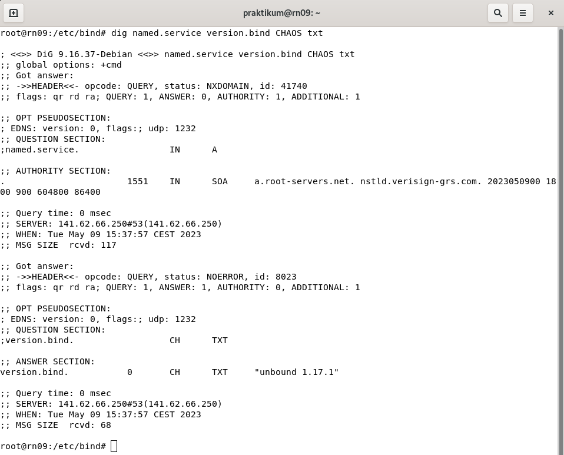
<br>
*Abbildung 8 - Bind Version*

> Die Version des bind-Servers lässt sich u.a. mit folgendem Befehl abfragen:
>> dig @127.0.0.1 version.bind CH TXT
>
>Die Version lautet: 9.16.37

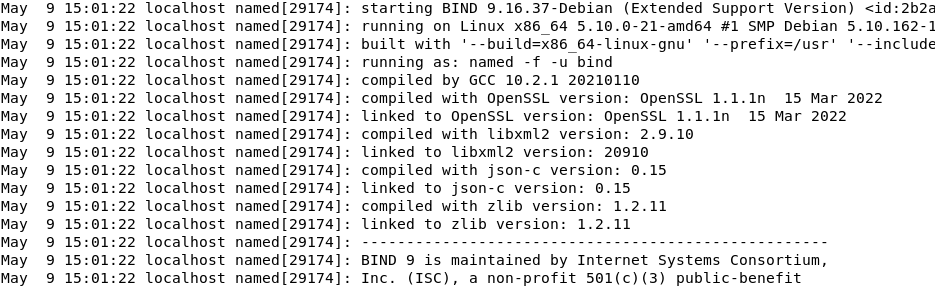
<br>
*Abbildung 9 - Bind server hat erfolgreich gestartet*

> Der Bind Server hat ohne Fehler gestartet, wie man am log erkennen kann.

```
d) Prüfen Sie, ob DNS requests von ihrem BIND-Server bereits beantwortet werden.
Welcher Nameserver antwortet bei nslookup ix.de oder dig ix.de? Was müssen sie noch
ändern?
Was bedeutet in diesem Zusammenhang bei nslookup die Auskunft „Non-authoritative
answer“?
```

> Unser BIND-Server hat DNS requests direkt richtig beantwortet.

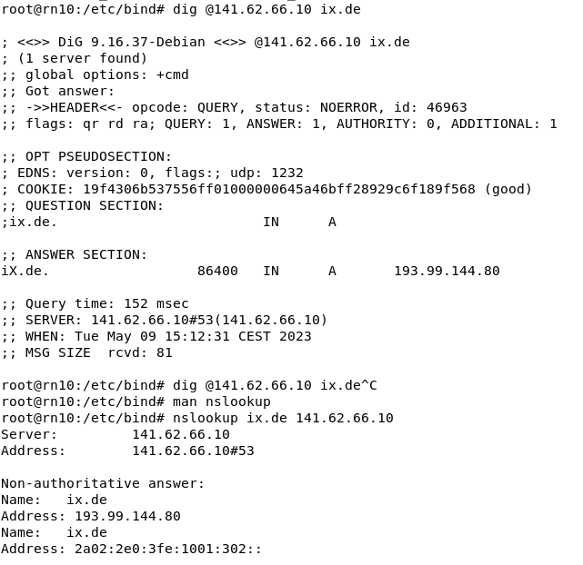
<br>
*Abbildung 10 - DNS-Request an lokalen BIND-Server für ix.de mit dig und nslookup*

> Bei normaler Verwendung von nslookup oder dig wird der DNS-request an den im Interface konfigurierten DNS-Server oder an das Standard-Gateway
> geschickt.
> Um den lokalen Bind-Server zu verwenden, muss im command die IP-Adresse der lokalen Maschine explizit mitgegeben werden:
>> dig @141.62.66.10 ix.de
>
> Oder unter nslookup mit
>> nslookup ix.de 141.62.66.10

> Unter dig erkennt man über die fehlende 'aa'-Flag (Authoritative Answer), dass der Request nicht von einem autoritativen Nameserver kommt. Unter
> nslookup steht dies direkt in der Antwort.
> Der Request ist also von irgendeinem DNS-Resolver zwischen uns und dem autoritativen Nameserver beantwortet worden, nicht von einem autoritativen
> Nameserver direkt.
> Die Antwort ist also cached vom DNS-Resolver selbst oder von einem anderen DNS-Server, der nicht der autoritative Nameserver ist.

```
e) Es fehlt noch die Konfiguration der einzelnen Config-Dateien unter /etc/bind:

- named.conf # Definition der Include-Dateien
- named.conf.options # Forwarders/Recursion/ACL
- named.conf.local # Definition der Forward- und Reversezonen
- <ForwardZonen>.db # Datei mit den forward-Definitionen
- <ReverseZonen>.db # Datei mit den reverse-Definitionen

Wichtig ist hierbei die genaue Einhaltung der Syntax, da BIND extrem pingelig ist.
Als Domain können Sie eine Phantasie-Domain nutzen, z.B.: rntest1.de
Die drei named.conf/named.conf.local/named.conf.options-Dateien lassen sich auch
vereinen in der named.conf. Das erleichtert das Editieren und die Orientierung etwas. Sie
packen in dem Fall die Inhalte aus named.conf.local und named.conf.options in die
named.conf

Zur Kontrolle, ob alle Dateien korrekt konfiguriert sind, nutzen Sie:

sudo named-checkzone <zonename> <filename> ## Kontrolle der 2 Zonen-Dateien
sudo named-checkconf ## Kontrolle der named-Konfig

```

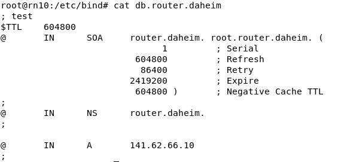
<br>
*Abbildung 11 - db Zonendatei für die Domain 'router.daheim'*

> In der Zonendatei definieren wir uns selbst als autoritativer Nameserver und setzen einen A-Record auf die IP unserer eigenen Maschine.

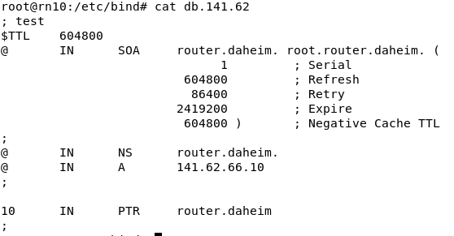
<br>
*Abbildung 12 - db Zonendatei für Reverse-DNS Lookups*

> In der Zonendatei für die Reverse Zone findet sich der benötigte PTR Eintrag um gegebene IP-Adressen auf domain-Namen mappen zu können.
> Der A-Record wird hier nicht mehr zwingend benötigt.

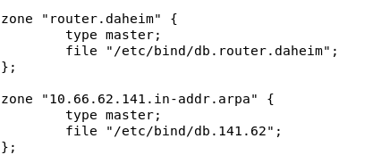
<br>
*Abbildung 13 - named.conf Einträge für unsere Domain 'router.daheim'*

> Unsere Dateien für die zwei neuen Zonen müssen natürlich auch noch in der named.conf angegeben werden.
> Wir haben uns für eine vereinigte named.conf mit allen Einstellungen in einer Datei entschieden, daher erfolgten die Einträge direkt in die
> named.conf.
>
> Gut zu sehen ist auch die invertierte Schreibweise für die Reverse-Zone, mit der für rDNS reservierten Domain 'in-addr.arpa'.


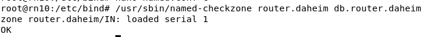
<br>
*Abbildung 14 - Überprüfung der Konfiguration*

> Wir haben die Konfiguration mit `named-checkzone` und `named-checkconf` überprüft und keine Fehler erhalten.

```
f) Erläutern Sie den Sinn der ersten Zeilen der Zonen-Dateien:
$TTL 604800
@ IN SOA rn21.rnlabor.de. admin.rnlabor.de. (
2 ; Serial
604800 ; Refresh
86400 ; Retry
2419200 ; Expire
604800 ) ; Negative Cache TTL
;
```

> Diese Zonendatei gibt an, dass "rn21.rnlabor.de." der primäre Nameserver für die Zone ist, sowie "admin.rnlabor.de." die E-Mail des zuständigen
> Administrators ist.

> * TTL: Gibt die Time-to-Live für alle Einträge einer Zonendatei an. Die TTL definiert, wie lange DNS-Clients Informationen aus dem Cache
    > verwenden sollen, bevor sie eine neue Anfrage an den Server stellen.
> * IN: Gibt die DNS-Klasse an, in dem Fall "Internet", also gedacht für das Internet Protocol (IP).
> * SOA: Start of Authority Record, der autoritative Informationen über die Zone enthält.
> * Serial: Seriennummer der Zone, wichtig für slave-Nameserver um Änderungen anzuzeigen.
> * Refresh: Zeit in Sekunden die gewartet wird, bevor die Slave-Nameserver nach Änderungen beim Master prüfen.
> * Retry: Zeit in Sekunden die gewartet wird, nachdem ein Zone-Transfer fehlgeschlagen ist, bevor die Slave-Nameserver den Vorgang
    > erneut versuchen.
> * Expire: Zeit in Sekunden, nach der die Slave-Nameserver ihre Zonen-Einträge als ungültig markieren sollen, falls der Master-Server nicht
    > für einen Transfer erreichbar ist.
> * Negative Cache TTL: Gibt in Sekunden an, wie lange "negative" Antworten also z.B. nicht gefundene Einträge oder andere Fehler gecached werden.

# Aufgabe 3 Caching/Recursion/Forwarder

```
a) Schalten Sie in Ihrer Konfiguration die „recursion“ aus (recursion ist per Default
aktiviert). Wie sehen anschließend Ihr DNS-Requests aus? Welche Anfragen
funktionieren noch und welche nicht?
Schalten Sie anschließend die „recursion“ wieder ein.
```

> Wenn wir die Rekursion in der DNS-Konfiguration deaktivieren, bedeutet das, dass unser DNS-Server keine rekursiven Anfragen im Namen der Clients
> mehr durchführt.
> Stattdessen können wir nur noch Antworten für unsere eigene lokale Zone bereitstellen, oder an andere DNS-Server referenzieren.

> Wenn Rekursion deaktiviert ist, funktionieren die folgenden Arten von DNS-Anfragen nicht:

> 1. Rekursive Anfragen: Anfragen von Clients, die nach einer vollständigen Auflösung einer Domäne suchen, bei der wir bei Bedarf Anfragen an andere
     > DNS-Server weiterleiten.

> DNS-Anfragen, die weiterhin funktionieren, wenn Rekursion deaktiviert ist:

> 1. Lokale Zonenanfragen: Anfragen für Domänen, für die wir als autoritativ gelten und die wir lokal verwalten können.
> 2. Reverse-Lookup-Anfragen: Anfragen, bei denen die IP-Adresse in eine Domäne umgewandelt wird, wenn wir die entsprechende Reverse-Zone enthalten.
> 3. Iterative Anfragen: Anfragen von DNS-Servern, bei denen wir dem fragenden Server alles zu einer Domain an Informationen geben, was wir haben,
     > aber ohne rekursive Anfragen im Auftrag des Anfragenden zu senden.

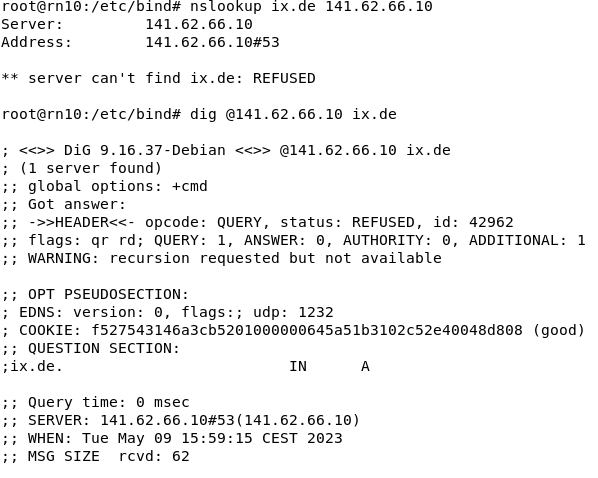
<br>
*Abbildung 15 - Versuch der Namensauflösung ohne Rekursion, schlägt fehlt*

```
b) Setzen Sie die Cache-Zeit durch Anpassung der Konfiguration herunter.
Woran erkennt man, daß der Cache bereits ein DNS-Ergebnis enthält?
```

> Wenn wir die Cache-Zeit durch Anpassung der Konfiguration heruntersetzen, bedeutet dies, dass DNS-Ergebnisse für kürzere Zeiträume im Cache
> gespeichert werden. Dadurch werden die Ergebnisse schneller veraltet und der DNS-Server muss
> häufiger neue Anfragen stellen, um aktuelle Informationen zu erhalten.

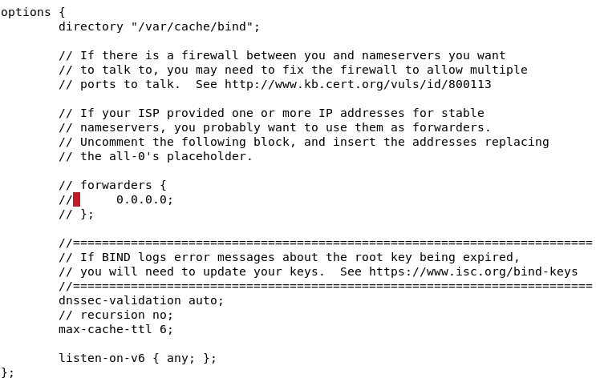
<br>
*Abbildung 16 - Verringerte Cache-Zeit in den BIND options*

> Man erkennt, dass der Cache bereits ein DNS-Ergebnis enthält, wenn eine Anfrage an den DNS-Server gestellt wird und dieser die Antwort sofort
> liefern
> kann, ohne eine externe Abfrage durchzuführen. Statt den Anfrageprozess von Anfang an
> zu durchlaufen, kann der DNS-Server die Antwort direkt aus dem Cache abrufen und an den Client zurücksenden. Dies führt zu einer schnelleren
> Reaktionszeit (i.d.R. 0ms), da der DNS-Server nicht extern nach dem Ergebnis suchen muss.

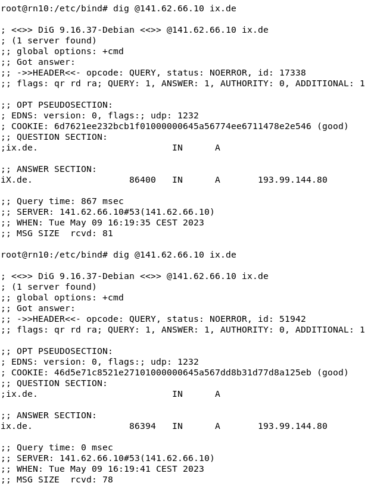
<br>
*Abbildung 17 - Unterschied der Query Time bei cached und non-cached request*

> Ohne Cache hat die Request 867ms benötigt.

```
c) Was ändert sich, wenn Sie einen DNS-Forwarder konfigurieren?
Flushen Sie vorher ihren DNS-Server-Cache.
Wireshark kann den Unterschied sehr schön zwischen Forward und Recursion
aufzeigen!
```

> Wenn wir einen DNS-Forwarder konfigurieren, leiten wir DNS-Anfragen an unseren DNS-Server komplett an einen anderen DNS-Server weiter. Dadurch wird
> unser DNS-Server zu einem Vermittler zwischen dem Client und dem weitergeleiteten DNS-Server.

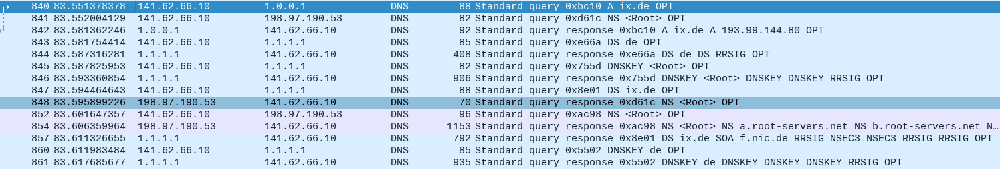
<br>
*Abbildung 18 - DNS Request Wireshark log bei aktiviertem Forwarder*

> Der Unterschied zwischen Forwarding und Rekursion kann mit Wireshark deutlich dargestellt werden. Wenn wir Forwarding aktivieren, sehen wir in den
> Wireshark-Paketen, dass unser DNS-Server die Pakete an den Forwarder weiterleitet und Rekursion erwünscht ist. Der Server, an den weitergeleitet
> wird, führt die rekursiven Requests also im Namen von uns aus, wir merken davon nichts und erhalten nur unsere eine Antwort auf eine Request.

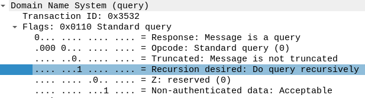
<br>
*Abbildung 19 - Rekursion ist über die Flags erwünscht*

> Im Gegensatz dazu, wenn wir auf unserem Server Rekursion aktivieren und nicht alles forwarden, wird unser DNS-Server die Anfragen im Namen der
> Clients selbstständig rekursiv beantworten,
> indem er ggf. andere
> DNS-Server konsultiert, um die vollständigen Antworten zu erhalten. In den Wireshark-Paketen
> sehen wir dann, dass unser DNS-Server mehrere Anfragen an andere DNS-Server sendet und auch mehrere Antworten erhält, am Ende aber wieder eine
> Antwort an den Client zurückgibt.

```
d) Welchen Sinn machen Forwarder überhaupt?
```

> Forwarder haben einen Sinn, da sie die Effizienz und Leistung von DNS-Abfragen verbessern können. Indem wir einen Forwarder konfigurieren,
> delegieren
> wir die Aufgabe der Namensauflösung an einen spezialisierten DNS-Server, der
> möglicherweise über eine größere Kapazität und schnellere Verbindungen zu anderen DNS-Servern verfügt.
> Im Optimalfall werden dafür aber bestimmte forwarding rules eingesetzt, statt einfach alle Requests weiterzugeben.

> Dadurch profitieren wir u.a. von folgenden Vorteilen:

> 1. Verringerte Netzwerklatenz: Durch die Nutzung eines Forwarders können DNS-Anfragen schneller beantwortet werden, da der Forwarder in der Regel
     näher am Client oder besser mit dem Netzwerk verbunden ist.
> 2. Geringerer Netzwerkverkehr: Wenn unser DNS-Server einen Forwarder verwendet, muss er nicht direkt mit anderen DNS-Servern kommunizieren, um
     externe Auflösungen durchzuführen. Dadurch wird der Netzwerkverkehr reduziert, da nur die
     relevanten Anfragen an den Forwarder gesendet werden. Außerdem verfügen spezielle Forwarder-Server i.d.R. über einen deutlich größeren Cache
     > was auch die allgemeine Netzwerklast verringert.
> 3. Bessere Skalierbarkeit: Indem wir einen Forwarder für bestimmten, fürs uns nicht so wichtigen Traffic verwenden, können wir unsere
     > DNS-Infrastruktur besser skalieren, da der Forwarder den Großteil
     der Last übernimmt. Dadurch kann unser DNS-Server effizienter arbeiten und eine größere
     Anzahl von für uns wichtige Anfragen bewältigen.

> Forwarder haben noch einige weitere Vorteile.

# Aufgabe 4 ACLs

```
Realisieren Sie eine Konfiguration mithilfe von Access Control Lists (ACLs) bei der nur Ihr
Rechner und ihre Teilgruppe DNS-Requests an Ihren DNS-Server absetzen kann.
Überprüfen können Sie ihre Konfiguration auf Funktionsfähigkeit, indem Sie andere Gruppen
auffordern ihren DNS-Server zu nutzen.
```

> Um die Konfiguration mit Access Control Lists (ACLs) umzusetzen, haben wir die folgenden Schritte befolgt:

> 1. Konfiguration der ACLs auf dem DNS-Server: Wir haben die Konfigurationsdatei unseres DNS-Servers (named.conf) geöffnet und eine ACL
     definiert. Hier ist ein Beispiel für eine ACL-Konfiguration mit unserer IP und der Nachbar-IP:

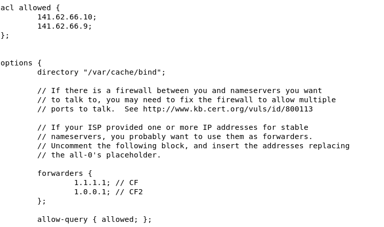
<br>
*Abbildung 20: ACL IP Liste und allow-query {} in der BIND Config*

> 2. Anwendung der ACLs auf den DNS-Server: Wir haben die soeben definierte ACL auf unseren DNS-Server angewendet. Dazu haben wir die ACL in den
     entsprechenden Abschnitten der Konfigurationsdatei referenziert.

```
options { // ...

allow-query { allowed; };

// ... };
```

> Dadurch erlauben wir nur den in der ACL definierten Clients, DNS-Abfragen an unseren Server zu stellen.
> Durch diese Konfiguration mit ACLs haben wir die Zugriffssteuerung auf unseren DNS-Server beschränkt, sodass nur unser eigener Rechner und der
> Nachbar-Rechner DNS-Anfragen stellen können.

> Wir haben die Konfiguration mit unseren Nachbarn getestet, sobald wir sie aus der ACL rausnahmen, konnten sie keine DNS-Queries über unseren
> BIND Server mehr auflösen. Dafür muss nur die entsprechende IP negiert werden:

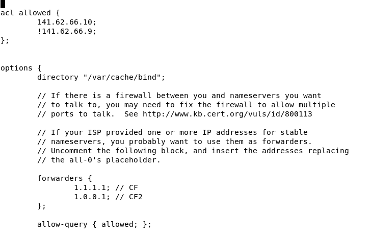
<br>
*Abbildung 21 - ACL mit Nachbar IP nicht erlaubt*

# Aufgabe 5 Master-Slave Konfiguration (Primary + Secondary)

```
Setzen Sie sich mit dem zweiten Teil ihrer Gruppe zusammen und realisieren Sie eine Master-
Slave BIND-Server Konfiguration. Die Teilgruppe, die den Slave-Part übernimmt, speichert
ihre Master-Konfigurationen ab, damit sie für die nächste Aufgabe wieder leicht auf den
Master-Zustand zurückkehren können.
```

> Der Rechner mit IP 141.62.66.10 hat bei uns den Master-Server übernommen, dazu war folgende Konfiguration nötig:

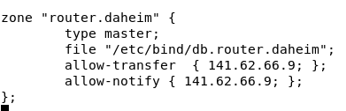
<br>
*Abbildung 22 - Konfiguration der Zonendatei des Master Servers in der named.conf*

> Hierbei ist wichtig den `type` auf `master` zu setzten sowie `allow-transfer` und `allow-notify` an den Slave-Server zu erlauben.

> Die Zonendatei des Masters sah bei uns so aus:

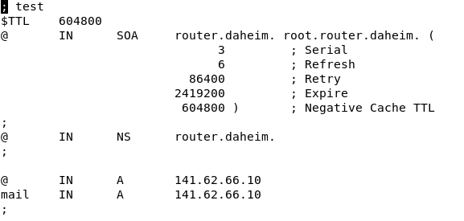
<br>
*Abbildung 23 - Zonendatei des Master Servers*

> Wir haben zwei A-Records angelegt um später die Konfiguration testen zu können.

> Die Konfiguration auf dem Slave-Server (141.62.66.9) sah so auß:

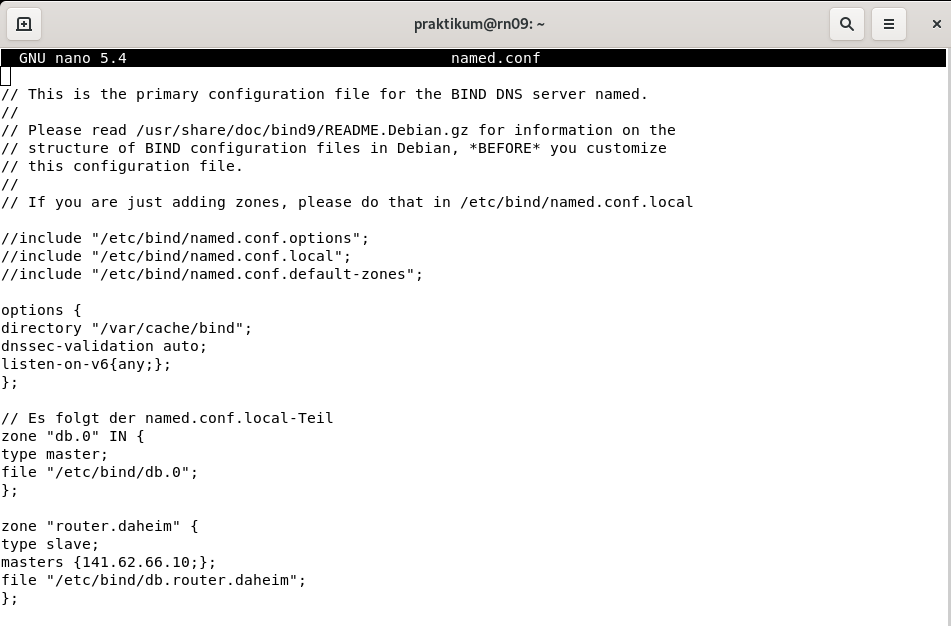
<br>
*Abbildung 24 - Konfiguration der named.conf auf dem Slave-Server*

> Hier wird der `type` auf `slave` gesetzt und der `masters` auf die IP des Master-Servers.

> Die Zonendatei ist dabei eine 1:1 Kopie der des Master-Servers.

> Erfolgen nun Änderungen an der Zonendatei durch den Master-Server (Zone Update), wie z.B. ein neuer MX Record, werden diese mit der Erhöhung der
> serial number bekannt gemacht. Der Slave sollte dann beim nächsten Zone Transfer die Änderung auf seine Zonendatei übernehmen.

> Wir konnten das Setup leider aus Zeitgründen nicht mehr testen, unsere Konfiguration ist aber korrekt und sollte funktionieren.

# Aufgabe 6 DoH (DNS-over-HTTPS)

## FÜr Aufgabe 6 blieb leider keine Zeit mehr.
