<div style="page-break-after: always;">
<center>
<span style="font-size: 20pt">
Praktikum Rechnernetze SS23 <br> Versuch 7: Switching <br> Gruppe 4 <br>
</span>
<br>
<span style="font-size: 11pt">
Versuch durchgeführt: 23.05.2023 <br>
HdM Stuttgart<br><br>
Gruppe 4 Mitglieder:
 <br> Fabian Weber – fw072
 <br> Darius Patzner – dp047
 <br> Jonas Gehrung – jg175
 <br> Adib Shaqaiq – as448
 <br> Jonas Öhler – jo041
 <br>
 <br> Labor-PCs 141.62.66.9 und 141.62.66.10 wurden während dieses Versuchs benutzt
</span>
</center>

</div>

# 1. Aufgabe - Allgemeines

```
a) Mal ganz dumm gefragt: Wieso haben manche Switches als Layer-2-Koppelelement
   eigentlich eine IP-Adresse?
```

> Ein Switch mit einer IP-Adresse ermöglicht es den Switch besonders einfach zu konfigurieren, zu überwachen und zu verwalten, auch in der Ferne.
> Dies ist z.B. über Telnet, SSH oder eine Web-basierte Benutzeroberfläche möglich, welche alle eine IP benötigen.
> Es ermöglicht außerdem noch andere "Spielereien" wie z.B. VLAN-Isolierung etc.

```
b) Ist ein Switch der eine IP-Adresse hat, automatisch ein Layer-3-Switch?
```

> Ein Switch gilt nicht automatisch als Layer-3-Switch, wenn er eine IP-Adresse besitzt. Ein Layer-3-Switch unterstützt neben den Funktionen eines
> Layer-2-Switches außerdem noch umfassende Routing-Funktionen, erst diese machen ihn zu einem Layer-3-Switch.

```
c) Was ist der Unterschied zwischen einem Layer-3-Switch und einem Router?
```

> Ein Layer-3-Switch ist eine Kombination aus einem Switch und einem Router und wird i.d.R. dazu verwendet, um den Datenverkehr zwischen (V)LANs
> zu steuern. Ein Router hingegen bietet erweiterte Routing-Funktionen und steuert i.d.R. den Datenverkehr zwischen verschiedenen Netzwerken (WAN).
> Ein Router verwendet ausschließlich IP-Adressen um den Datenverkehr zwischen Netzwerken zu routen, Layer-3-Switches nutzen primär MAC-Adressen.

# 2. Aufgabe - Switch Konfiguration

```
a) Sie bekommen die Switche sozusagen „originalverpackt“. Um die Geräte initial zu
   konfigurieren, müssen Sie ein serielles Kabel (Console) an den PC anschließen und
   Putty oder MobaXterm ( Console Serial: COMx, Speed: 9600; Console USB:
   COMx, Speed: 9600 ) starten. Da Switche nicht zwingend über eine IP-Adresse
   verfügen (siehe oben), sind sie auch nicht per Default über einen Browser erreichbar.
   Der übliche Weg einen Switch zu konfigurieren ist das CLI (Command Line Interface).
   Und dieser Weg führt über das Console-Kabel.
```

> Die Verbindung über den Serial Port hat mit den entsprechenden Putty Einstellungen funktioniert.

```
b) Wenn alles gut geht, möchte der Switch die Manager-Credentials setzen (Configure the
   manager credentials). Setzen Sie als Username manager und als Passwort versuch.
   Falls sich etwas anderes in Ihrem Consolen-Fenster zeigt, setzen Sie ihren Switch auf
   Factory Default zurück:
   - Unten links mit einer Büroklammer RESET drücken und anschließend gleich den
   - CLEAR- Button rechts daneben drücken und solange halten, bis die TEST-LED links
     anfängt zu blinken.
   - Dann können sie den CLEAR-Button loslassen und der Switch bootet in den
     Werkszustand.
   Des Öfteren kommt es gleich zu Beginn der Initialisierung zu Verwirrungen, falls die
   Console-Verbindung erst nach dem Booten des Switches zustande kommt. Der Switch
   wartet beim Booten auf die Bestätigung der Console-Geschwindigkeit. Hier muss man
   Praktikum Rechnernetze Versuch Switching Seite 6 von 12
   kurz hintereinander zweimal die ENTER-Taste drücken. Falls das nicht hilft, müssen
   sie ihren Switch neu booten.
```

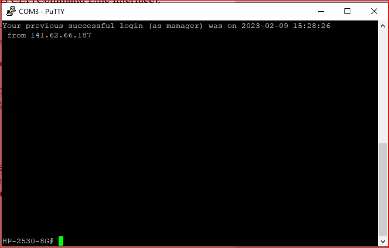
<br>
*Abbildung 1 - Setzen der Manager-Credentials*

> Das setup der Manager-Credentials funktionierte ohne Probleme und es waren keine weiteren Schritte notwendig.

```
c) Vergeben Sie für Ihren Switch die entsprechende IP (siehe Beschriftung auf dem
   Switch). Mit dem Befehl
   menu
   kommen Sie in ein textbasiertes Menu, mit dem Sie über
   Switch Configuration / IP Configuration
   die entsprechenden Einstellungen vornehmen können:
   Default Gateway: das schon bekannte RN-Gateway aus anderen Versuchen
   IP Config: manual
   IP Address: entsprechend der Beschriftung
   Subnet Mask: passend dazu
```

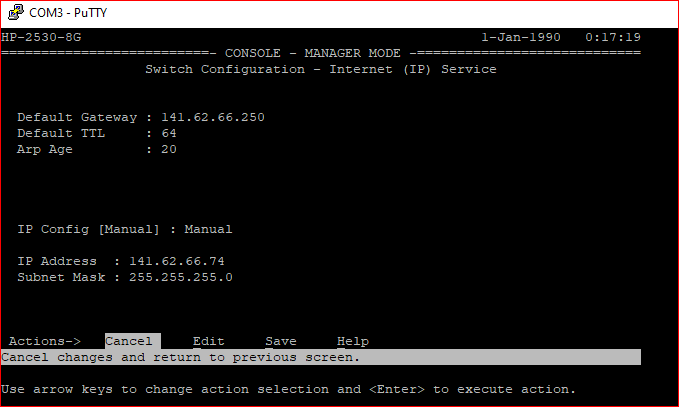
<br>
*Abbildung 2 - IP-configuration des Switches*

> Wir haben alle Einstellungen entsprechend der vorgegebenen Angaben konfiguriert.

```
Konfigurieren Sie ebenfalls die Location, Contact, SNMP (public) und setzen sie ein
Passwort für den user “operator“.
```

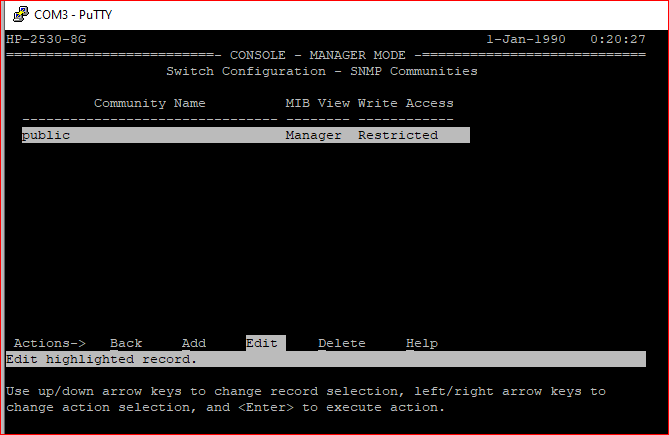
<br>
*Abbildung 3 - SNMP configuration*

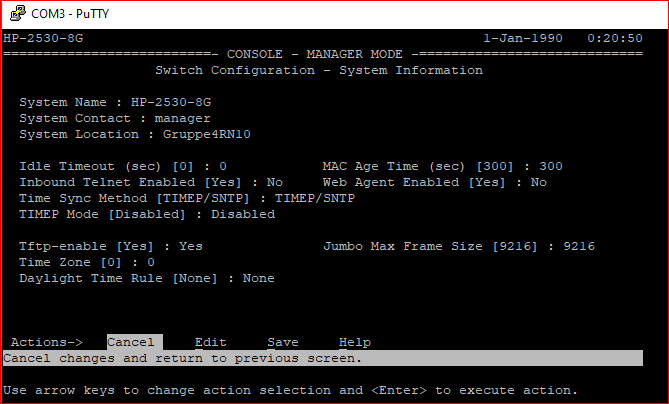
<br>
*Abbildung 4 - Konfiguration der Location und Contact*

> Als Contact haben wir den manager gesetzt und als Location unsere Gruppennummer und den Rechner, den wir verwendet haben.

```
d) Ist der telnet-Zugang aktiviert. Was ist problematisch an Telnet?
```


<br>
*Abbildung 5 - Telnet standardmäßig deaktiviert*

> Der Telnet Zugang ist standardmäßig deaktiviert. Das Problem mit Telnet ist, dass Daten unverschlüsselt übertragen werden und es somit möglich ist,
> Benutzernamen, Passwörter und andere sensible Daten abzuhören. Außerdem bietet Telnet keine eingebaute Authentifizierung.

```
e) Was ist in diesem Zusammenhang der Unterschied zwischen manager und operator?
   Wichtig ist, daß Sie Ihre Konfiguration ab und zu sichern:
   write memory
   erledigt das.
```

> Der Unterschied zwischen einem Manager und einem Operator besteht in den Zugriffsrechten. Der Manager hat mehr Berechtigungen und ist für die
> Konfiguration und Verwaltung des Switches zuständig. Der Operator hingegen ist für den Betrieb sowie Instandhaltung verantwortlich.

```
f) Nach der IP-Konfiguration ist ihr Switch auch über einen Web-Browser erreichbar.
   Neuerdings bietet HP dazu zwei unterschiedliche GUIs an. Schauen Sie sich diese beiden
   GUIs an und bilden Sie sich ein Urteil.
```

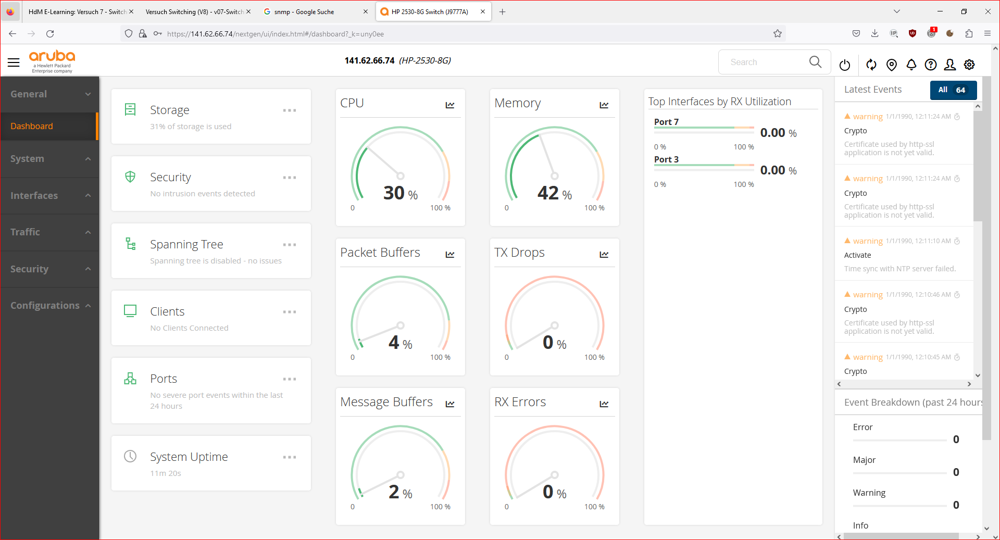
<br>
*Abbildung 6 - Modernes Webinterface*

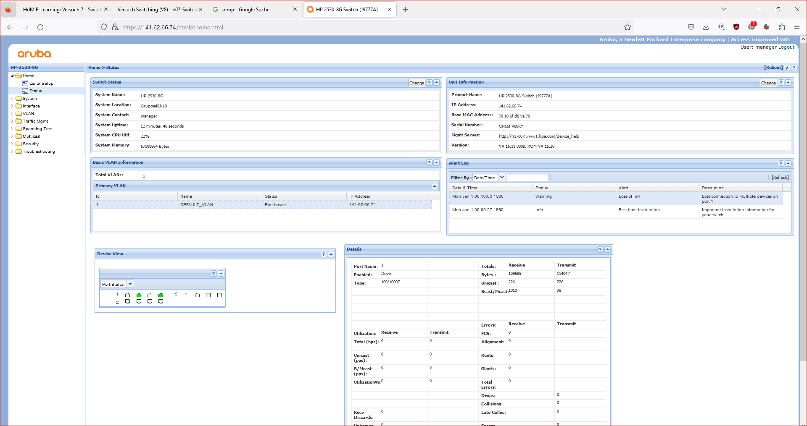
<br>
*Abbildung 7 - Altes Webinterface*

> Die alte GUI enthält auf den ersten Blick mehr Funktionen als die neue, ist dafür aber weder responsive noch besonders benutzerfreundlich.
> Die neue GUI ist benutzerfreundlicher und arbeitet viel mit farblichen Visualisierungen (Graphen etc.). Dadurch erhält man schnell einen guten
> Überblick über den Zustand des Geräts.

# 3. Aufgabe

```
a) Starten Sie Wireshark und dokumentieren Sie die Protokolle die bereits jetzt Traffic
   in Zusammenhang mit ihrem Switch erzeugen (abgesehen von ihren eigenen http-
   Anfragen und die ARP-Anfragen von 141.62.66.236 (=FOG-Cloning Server) oder
   anderen Servern/Routern (=141.62.66.240, 141.62.66.250...). Welchen Wireshark-
   Filter setzen Sie ein, um möglichst nur noch den Traffic ihres Switches
   einzufangen?
 
```

> Im Versuch haben wir einfach alle Protokolle ausgeschlossen, welche uns nicht interessiert haben bei dieser Aufgabenstellung, d.h.
> `!http && !arp && !tcp && !tls`
> Also kein TLS, weder http, arp noch tcp. Jedoch könnte man auch einfach nach der MAC des Switches filtern mit `eth.addr ==`.
>
> Im Capture sieht man dann noch Protokolle wie das LLDP (Link Layer Discovery Protokoll), das HP eigene Protokoll "HP Switch Protocol", oder das
> NBNS-Protokoll.
> Das Protokoll LLDP ist ein Layer-2 Protokoll und dient zur Weiterleitung von Geräteinformationen an Nachbargeräte.
> Das Protokoll von HP ist ein Hersteller-spezifisches Protokoll, vermutlich für HP-interne Funktionen.
> NBNS (NetBIOS Name Service) bietet Namensauflösung, speziell für Windows-Netzwerke und Geräte.

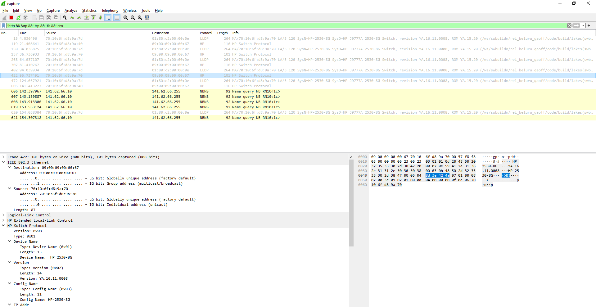
*Abbildung 8 - Wireshark Protokolle*

```
b) Was ist LLDP? 
Bringen Sie Ihren Windows-Client dazu, LLDP in Verbindung mit Ihrem Switch zu realisieren.
```

> LLDP steht für "Link Layer Discovery Protocol" und ist ein standardisiertes Netzwerkprotokoll, das es Geräten ermöglicht, Informationen über ihre
> Identität, ihre Fähigkeiten und ihre Nachbargeräte in einem Ethernet-Netzwerk auszutauschen. Es wird auf der Link Layer des OSI-Modells
> implementiert und ermöglicht eine automatische Topologie erkennung in einem Netzwerk.
>
> Der LLDP-Dienst ermöglicht es einem Gerät, seine Identität, Konfigurationsinformationen und andere relevante Daten über den Netzwerkanschluss zu
> senden. Diese Informationen können von anderen Geräten, die ebenfalls LLDP unterstützen, empfangen und verwendet werden, um die Netzwerkstruktur und
> -topologie zu verstehen.
>
> Um den LLDP-Dienst auf einem Windows-Client zu realisieren, muss der LLDP-Dienst von Drittanbietern installiert werden.
> Ein Beispiel dafür ist der LLDP-Dienst von https://raspi.github.io/projects/winlldpservice/.
> Nach der Installation haben wir die Konfiguration dieses Dienstes abgeschlossen und somit auf dem Windows-Client kann der Client LLDP-Nachrichten
> senden und empfangen und deshalb Informationen über den angeschlossenen Switch und dessen Nachbargeräte erhalten.
>
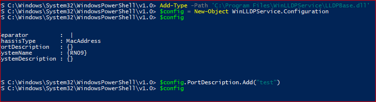 <br>
*Abbildung 9 - Konfiguration LLDP*

> Auf einem Linux-System kann der LLDP-Dienst mit dem Befehl "apt install lldpd" nachinstalliert werden.

> In dem unteren beigefügten Screenshot kann man das Link Layer Display Protocol nach unserer erfolgreichen Installation des LLDP-Dienstes auf dem
> Windows-Client in Wireshark sehen.

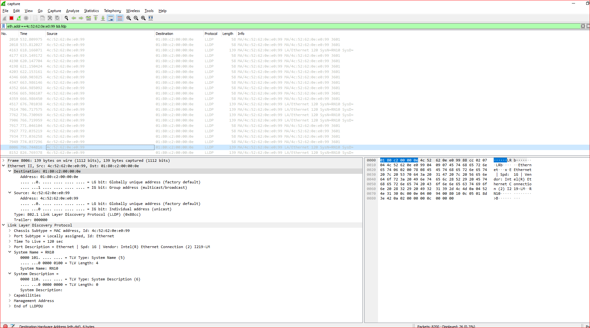
*Abbildung 10 - Wireshark zeigt LLDP Protokoll Pakete auf unserem Windows Client*

# 4. Aufgabe

```
a) Laden Sie sich die Switch-Konfiguration auf ihren PC und schauen Sie sich die Datei
mit einem Texteditor an. Über welche Wege gelangen Sie an die Konfiguration?
Die Angaben/Zeilen in dieser Datei sind als einzelne Befehle zu verstehen, die auch
direkt auf dem Switch über das CLI eingegeben werden können.
Ändern Sie in der heruntergeladenen Config-Datei den Namen des VLAN 1 und
spielen Sie diese Datei als Konfiguration zurück auf den Switch.
```

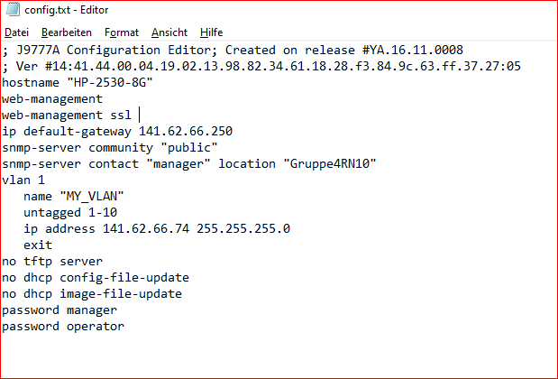
<br>
*Abbildung 11 - Config-File des Switches im Editor*

> Hierfür muss díe Config-File mit dem Command `copy running-config tftp 141.62.66.10 config.txt` auf den TFTP-Server des Windows-Rechners kopiert
> werden. Danach kann die Datei geöffnet werden.
>> Wichtig: tftpd32 muss auf dem PC laufen und die Windows Firewall muss die Verbindung zulassen!

> In Abbildung 11 kann man die Config-File sehen. Hier muss unter VLAN1 bei dem key "name" ein beliebiger Name als "value" eingetragen werden.
> Danach muss nur die Datei gespeichert und mit dem Command "copy tftp startup-config 141.62.66.10 config.txt" die Config-file from TFTP-Server wieder
> auf den Switch kopiert werden. Der Switch rebootet danach automatisch neu und wendet die neue config an.

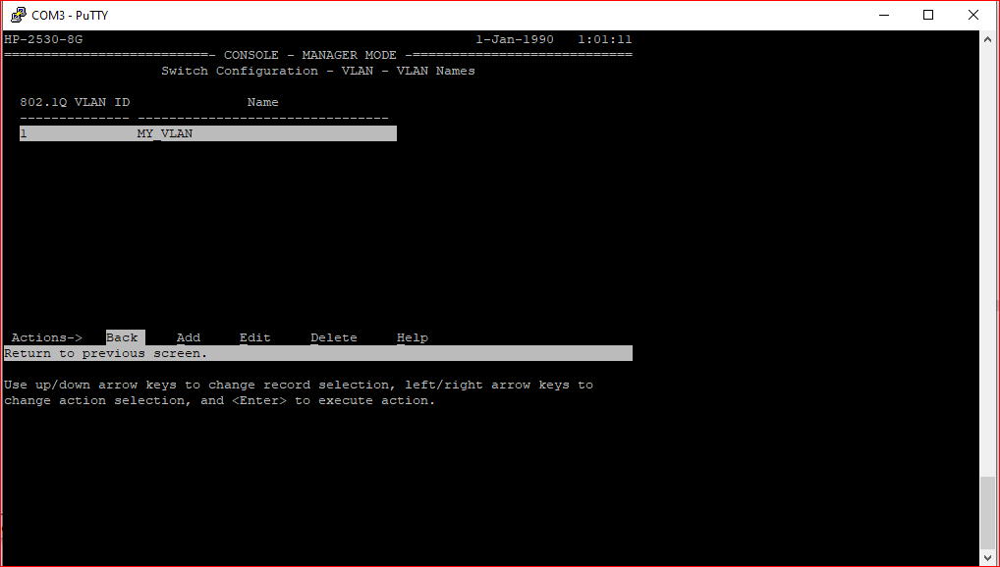
<br>
*Abbildung 12 - Geänderter VLAN-Name, sichtbar im CLI*

> Wenn man nun in der Console im Configurations-Menü unter "Switch-Configuration - VLAN - VLAN Names" nachschaut, sieht man den gleichen Namen,
> der in der Config-File soeben eingetragen wurde.
> Der Name des VLANs kann ebenfalls im gleichnamigen Menü-Punkt oder über das Web-Interface geändert werden.

```
b) Aktivieren Sie über das CLI das Web-Management, so das der Switch auch über Port
80 erreichbar ist.
Welche Informationen dazu bietet Ihnen der Befehl show running-config.
```

> Um den Switch per Webmanagement auch über Port 80 erreichbar zu machen, muss das "no" vor dem web-management Befehl entfernt werden.
> Dazu muss zuerst in den Configurations-Modus gewechselt werden, in dem man den Command `configure` eingibt.
> Als Nächstes kann man sich mit `show web-management` die derzeitige Configuration anzeigen lassen.
> Dann kann man mit dem Command `web-management` das Webmanagement-Interface auch über Port 80 erreichbar machen.

> Mit `show running config` kann man sich noch mal die derzeitige Konfiguration anzeigen lassen.

> Natürlich kann diese Config-Änderung auch wieder über den TFTP-Server erfolgen.

> Nach erfolgreichem setzen dieser Einstellung war das Webinterface auch über Port 80 erreichbar:


*Abbildung 13 - Zugriff auf das Webinterface auch über unverschlüsselten Port 80*

# 5. Aufgabe -Spanning Tree

## Switch ohne Spanning-Tree-Verfahren

```
Deaktivieren Sie das Spanning-Tree-Verfahren. Stecken Sie nun eine schleifenbehaftete
Konfiguration und erzeugen Sie ein Broadcast-Paket. (ARP- Tabelle am PC löschen und einen
Ping auf eine IP-Adresse starten (z.B. 141.62.66.250). Verwenden Sie dazu den Protokoll-
Analyzer Wireshark und beobachten Sie die Netzauslastung im Taskmanager. Dokumentieren
Sie Ihre Vorgehensweise und die gewonnenen Ergebnisse.
```

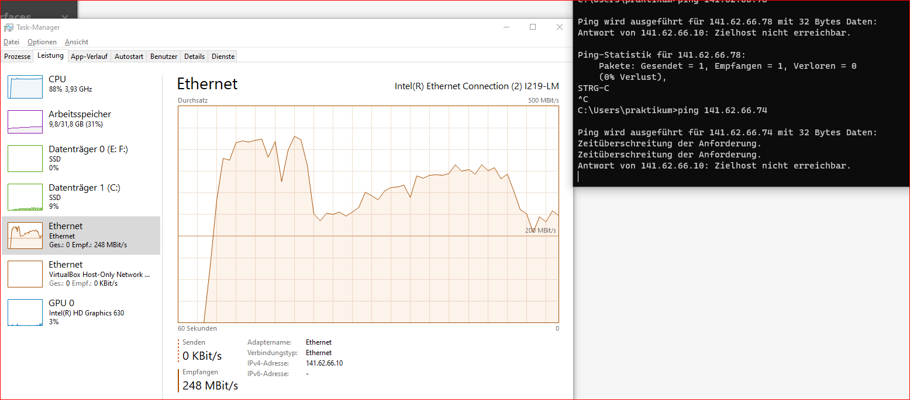<br>
*Abbildung 14 - Task-Manager Ansicht eines Broadcast Storms*

> Nach Deaktivieren des STP und stecken einer Schleife, sowie erzeugen eines Broadcast-Pakets, sieht man den sofortigen Anstieg der
> Netzwerkbandbreite und der CPU-Last. Das ist auf die Endlosschleifen zurückzuführen, in welche die Broadcast-Pakete geschickt werden.
> Sofort nach Senden eines solchen Pakets wurde unser Switch für Ping-Anfragen unerreichbar, ebenfalls reagierte das Webinterface nicht mehr.
> Ebenfalls konnten wir eine beachtliche Erwärmung des Switches und besonders der Ports feststellen, alle Status-LEDs an den Ports erlischten.

> Offensichtlicherweise sollte man den Switch so nicht lange "quälen", da es eine erhebliche Last für die CPU darstellt und ungekühlte oder
> unzureichend gekühlte Komponenten nach einer gewissen Zeit beschädigen kann.

> Unser Wireshark hat sich aufgrund der Last bereits nach einer kurzen Zeit aufgehängt und ist abgestürzt, wir konnten aber noch einen
> Paket-Counter von über 100k beobachten.

## Switch mit Spanning-Tree-Verfahren

```
a) Lassen Sie die Verkabelung aus der vorangegangenen Aufgabe zunächst unverändert
   und aktivieren Sie das Spanning-Tree-Protokoll (Versuchen Sie herauszufinden was in
   ihrem Fall einzustellen ist, MSTP oder RSTP). Eventuell müssen Sie dafür die Kabel
   kurz abstecken, um wieder am PC arbeiten zu können (hohe Auslastung des PC
   aufgrund vieler Netzwerkpakete). Beschreiben Sie Ihre Beobachtung. Stecken Sie nun
   wieder die Schleife zwischen den Switches und versuchen Sie durch Verändern der
   Parameter, den Ring an einer Stelle zu unterbrechen (Hinweis: spanning-tree <port
   oder port-list> priority <priority-multiplier> ).
```

> Für unsere Zwecke sollte RSTP reichen, da es sich um ein kleines Netzwerk handelt und RSTP allgemein schneller auf Netzwerkänderungen reagieren
> kann.

> Nach aktivieren von STP, beginnt RSTP direkt damit die aktive Schleife zu beseitigen. Die redundanten Ports werden auf Blocking gesetzt und es
> fließt keinerlei Datenverkehr mehr über diese Ports, um die Schleife zu unterbrechen. Wir konnten in wenigen Sekunden wieder mit dem Switch und
> anderen Netzwerkgeräten interagieren.

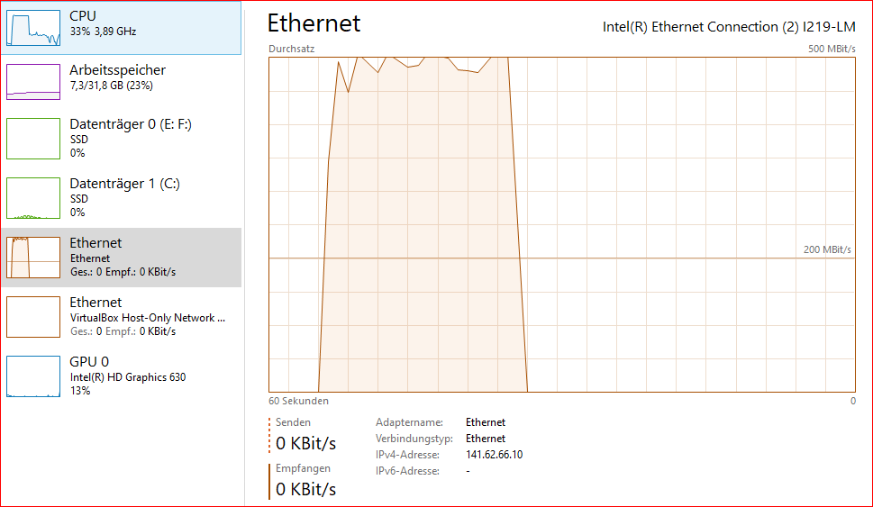<br>
*Abbildung 15 - Eliminierung der Schleife mit STP, beobachtet im Task-Manager*

> Hier sieht man gut den rapiden Abfall der Netzwerklast, nachdem STP die Schleife beseitigt hat.

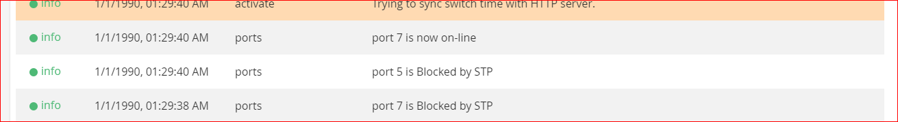<br>
*Abbildung 16 - STP blockt Switch-Ports eigenständig zur Vermeidung von Schleifen*

> Im Webinterface des Switches (oder im Log) kann man die geblockten Ports identifizieren.

> Durch Verändern des priority multipliers konnten wir die Priorität einzelner Ports ändern, z.B. so das er als Blocking-Port konfiguriert wird.

```
b) Welche Funktion hat das Protokoll BPDU (vgl. Anhang, Internet) in Zusammenhang
   mit Switches?
   In welchen Abständen sendet es der Switch? Was will er damit erreichen? Wenn Sie
   den nun aktiven Link unterbrechen, wie lange dauert es, bis Sie wieder alle
   Komponenten erreichen? Stoppen Sie die Zeit und interpretieren Sie dieses Ergebnis
```

> BDPU (Bridge Protocol Data Unit) ist die Bezeichnung für Datenpakete, die im Rahmen von STP zwischen Switches ausgetauscht werden. Sie enthalten
> Informationen zum Spannbaum sowie der Netzwerktopologie und werden zwingend für die korrekte Funktion von STP benötigt. Es handelt sich also
> nicht um ein eigenes Protokoll, sondern vielmehr um die Frames des STP.

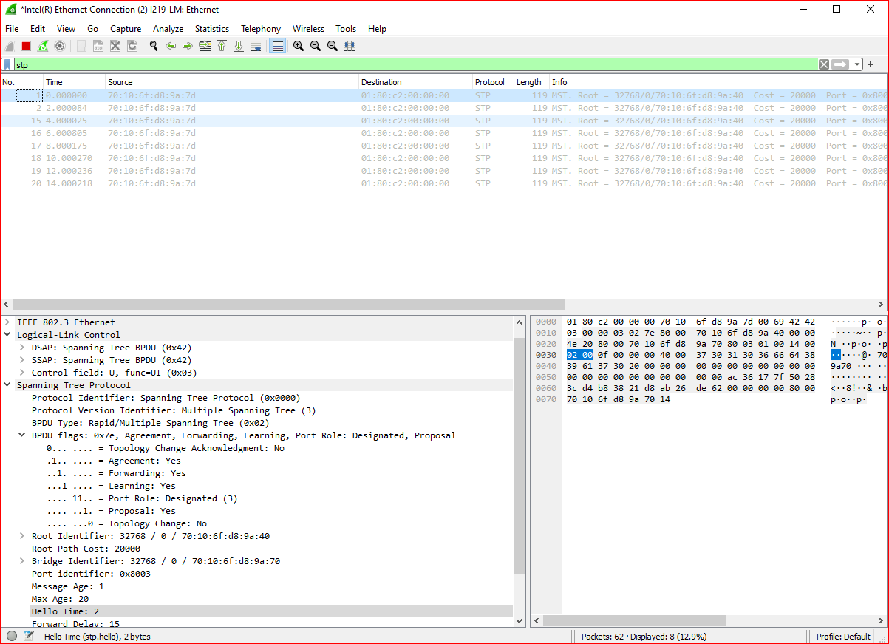<br>
*Abbildung 17 - BDPU Pakete in Intervallen*

> Der HelloTime Parameter gibt an, wie oft der Switch die BDPUs sendet. In unserem Fall mit RSTP sendete der Switch alle 2 Sekunden sein BDPU
> Multicast, um seine Anwesenheit im Netzwerk und den Zustand seiner Ports zu signalisieren.
>
> Über die BDPUs können noch viele weitere Parameter und Informationen mitgeteilt werden, wie im Screenshot zu sehen.

> Beim Unterbrechen des aktiven Links hat unser Switch ca. 2-3 Sekunden gebraucht um die Portzustände zu aktualisieren, danach waren alle
> Komponenten wieder per Ping erreichbar. Dieses Ergebnis korreliert mit der beobachteten HelloTime, im worst case braucht der Switch also alleine 2
> Sekunden um den Link Failure zu erkennen. Die Neuberechnung des Spanning Trees benötigt in solch einem kleinen Netz nicht lange.

```
c) Dokumentieren und interpretieren Sie die Ziel-MAC-Adresse, an die die BPDU-Pakete
   gesendet werden.
```

> Wie bereits erwähnt, handelt es sich bei den BDPU-Paketen im Screenshot um Multicasts, nämlich an `01:80:c2:00:00:00`.
>
> Diese spezifische MAC-Adresse ist reserviert für den Einsatz im STP, es handelt sich um eine "Spanning Tree Bridge Group Address".
> Die Idee dabei ist, dass jeder Switch der am STP teilnimmt, auf diese Multicast Adresse hört und die BDPUs empfängt.
> Auf diese Weise können die Switches Informationen über den Zustand des Spanning Trees austauschen, die Topologie des Netzwerks erkennen und den
> Spanning Tree entsprechend berechnen. Für uns als Computer sind diese Pakete eigentlich uninteressant und werden i.d.R. ignoriert.

```
d) Mit Hilfe von admin-edge-port kann man für einzelne Switchports das Forwarding
   aktivieren. Diese Option bringt einen Port sofort in den Forwarding-Zustand,
   unabhängig davon ob evtl. Schleifen vorhanden sind oder nicht. Wo ist diese Funktion
   sinnvoll einsetzbar? Was ist der Unterschied zu der Option auto-edge-port? Welche
   Befehle gibt es sonst noch um sich den Status des Spanning-Tree anzusehen (Der
   Befehl show und seine Optionen helfen weiter)?
```

> Die `admin-edge-port` Funktion kann in Situationen verwendet werden, in denen sichergestellt ist, dass beim Anschluss an den Switchport keine
> Schleifen entstehen werden, z.B. bei Anschluss an einen Endnutzer. Mit dieser Funktion kann die Konvergenzzeit von STP umgangen werden, in größeren
> Netzen mit komplexem Spannbaum kann so Zeit gespart werden. Die Funktion ist aber mit Risiko verbunden, es sollte lieber die normale
> Konvergenzzeit des STP abgewartet werden.

> Mit `auto-edge-port` erkennt der Switch selbst, ob es sich bei einem Switchport um einen Edge Port, also einen Endpunkt des Netzwerks (Client),
> handelt und wie dieser zu konfigurieren ist. Auch hier gibt es Sicherheitsrisiken, hängt am Ende doch z.B. ein Switch an einem Edge-Port, kann es zu
> einer Netzwerkloop kommen. Der Hauptunterschied zu `admin-edge-port` ist, dass der Switch anhand von Bedingungen entscheidet, ob der Forwarding
> State aktiviert wird. Bei `admin-edge-port` geschieht das ohne irgendeine Art von Prüfung.

> Mit `show spanning-tree` kann sich der Spanning Tree gut visualisiert werden. Weitere nützliche Befehle sind z.B. `show spanning-tree summary`
> für eine detailreiche Übersicht oder `show spanning-tree detail` für ganz genaue Informationen.

# Für die restlichen Aufgaben blieb leider keine Zeit mehr.
