<div style="page-break-after: always;">
<center>
<span style="font-size: 20pt">
Praktikum Rechnernetze SS23 <br> Versuch 8: Netzmanagement und Netzanalyse <br> Gruppe 4 <br>
</span>
<br>
<span style="font-size: 11pt">
Versuch durchgeführt: 13.06.2023 <br>
HdM Stuttgart<br><br>
Gruppe 4 Mitglieder:
 <br> Fabian Weber – fw072
 <br> Darius Patzner – dp047
 <br> Jonas Gehrung – jg175
 <br> Adib Shaqaiq – as448
 <br> Jonas Öhler – jo041
 <br>
 <br> Labor-PCs 141.62.66.9 und 141.62.66.10 wurden während dieses Versuchs benutzt
</span>
</center>

</div>

# 1. Aufgabe - SNMP

```
Erkunden Sie ein wenig die Möglichkeiten eines SNMP-Tools.
Unter Windows sind unter dem Benutzerordner „praktikum“ die Tools
• „snmp_tester_5.2.1“
• „iReasoning MIB-Browser“ (unter „mibbrowser)
• CMD-Tool „net-snmp“
installiert.
a) Erkennen Sie, wer der Verwalter des Gerätes 141.62.66.213, 141.62.66.214 und
141.62.66.215 ist (sysContact)? Starten Sie eine Anfrage an einen Switch, die
die Systeminfos abruft.
Befehl: snmpwalk –v 2c –c [community] [IPaddr] [objectID]
IP vom Switch: 141.62.66.2xx
community: public
objectID: . 1.3.6.1.2.1.1
```

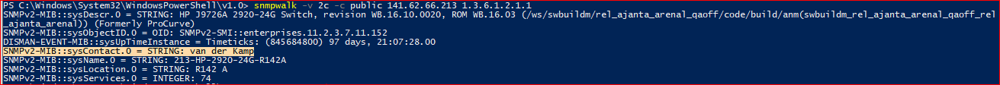
<br>
*Abbildung 1 - Verwalter von Switch 141.62.66.213*

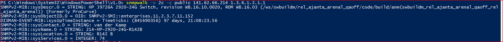
<br>
*Abbildung 2 - Verwalter von Switch 141.62.66.214*

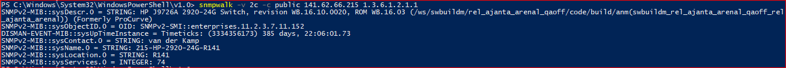
<br>
*Abbildung 3 - Verwalter von Switch 141.62.66.215*

> Mit der MIB-Variable `sysContact` kann der Verwalter ausgelesen werden. In allen drei Fällen war es `van der Kamp`, die verschiedenen Systeme
> sind unter anderem an den unterschiedlichen `sysLocation` Werten zu erkennen.

```
b) Nutzen Sie den Befehl snmpwalk, um zu ergründen auf welchem Switchport
(141.62.66.213, 141.62.66.214 oder 141.62.66.215) wie viel los war. Um welche
Einheit handelt es sich? Auf welchem Switchport war bisher offensichtlich kein
PC angesteckt? Tipp: Verwenden Sie ifInOctets als Teil der objectID.
Interessant sind die Switchports 10.1-10.24, sie entsprechen den Switchports 1-
24. Die folgenden Seiten helfen dabei die richtigen MIB-Einträge zu finden:
http://www.iphostmonitor.com/mib/mibs/rfc1213.html
https://tools.ietf.org/html/rfc1213
http://www.net-snmp.org/wiki/index.php/Tutorials
```

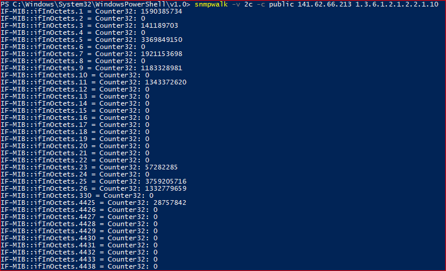
<br>
*Abbildung 4 - Traffic von Switch 141.62.66.213*

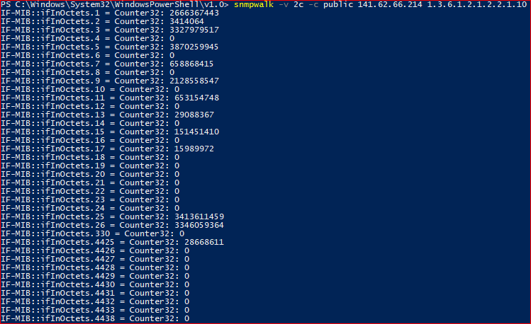
<br>
*Abbildung 5 - Traffic von Switch 141.62.66.214*

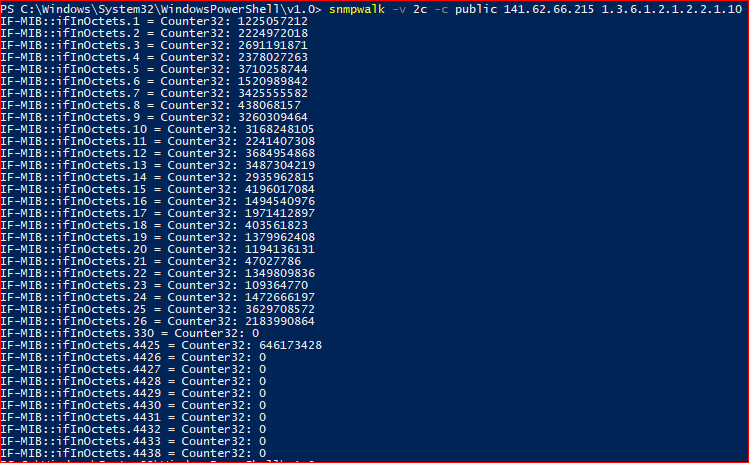
<br>
*Abbildung 6 - Traffic von Switch 141.62.66.215*

> Mit `ifInOctets` lassen sich die Gesamtzahl der empfangenen Octets seit letztem Neustart oder Reset auslesen.
> Die Einheit, in der die Werte angezeigt werden, ist Bytes (Synonym von Octet).
> An die Ports, die noch keine Bytes empfangen haben, ist vermutlich bisher kein Endgerät angeschlossen worden.

```
c) Welche „Geschwindigkeiten“ (10, 100, 1000 Mbit/s) haben die Interfaces derzeit
jeweils und warum? Was ist das besondere bei Port 25 auf Switch
141.62.66.215 ? (Hinweis: ifSpeed vs. ifHighSpeed)
```

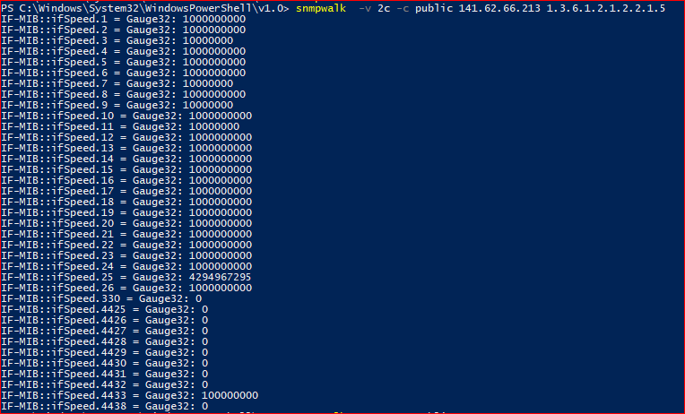
<br>
*Abbildung 7 - Port Geschwindigkeiten von Switch 141.62.66.213*
<br>

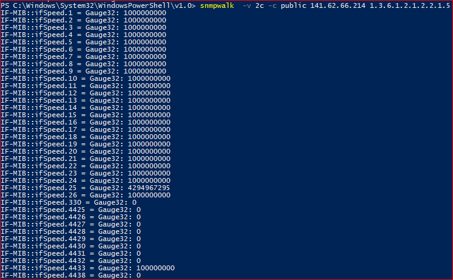
<br>
*Abbildung 8 - Port Geschwindigkeiten von Switch 141.62.66.214*
<br>

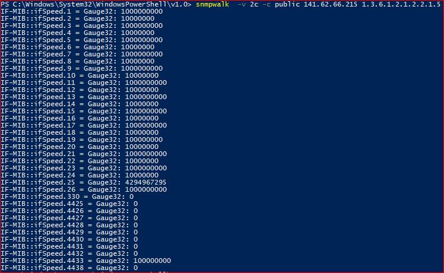
<br>
*Abbildung 9 - Port Geschwindigkeiten von Switch 141.62.66.215*
<br>

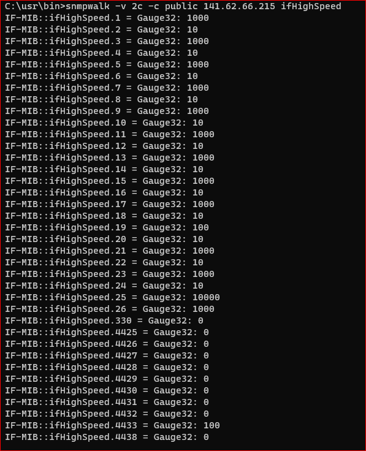
<br>
*Abbildung 10 - Port Geschwindigkeiten von Switch 141.62.66.215 mit anderer Einheit*
<br>

> Die `ifSpeed` und `ifHighSpeed` MIB-Variablen geben die aktuell ausgehandelte, maximale Geschwindigkeit der Ports in verschiedenen Einheiten an.
>
> Die meisten Interfaces haben eine Geschwindigkeit von 1000 Mbps, was den angegebenen `1000000000 Bps` entspricht. Dies ist die aktuell in der
> privaten Nutzung vermutlich am meisten verbreitete Port-Geschwindigkeit, die so ziemlich alle Einsatzmöglichkeiten abdeckt.
>
> Einzelne Interfaces weisen nur eine Geschwindigkeit von 10 Mbps auf, hierbei handelt es sich vermutlich um ausgeschaltete Geräte, die
> Out-of-Band Management Funktionen wie z.B. WOL (Wake on LAN) aktiviert haben und daher weiterhin auf Pakete hören müssen. Dafür wird keine
> Gigabit-Verbindung benötigt, daher handeln diese Geräte eine energiesparendere 10 Mbps Verbindung aus.
>
> Bei Port 25 ist ein Integer Overflow aufgetreten, was man mit `ifHighSpeed` erkennen kann, da hiermit der eigentliche Wert richtig dargestellt wird.
> Es handelt sich nämlich um einen 10 Gbps Port, der mit dem Wertebereich von dem SNMP-Datentyp `Gauge32` (32 Bit nicht-negativer Integer) nicht
> mehr in Bps Form (10000000000 > 4294967295) darstellbar ist. Die `ifHighSpeed` Variable nutzt die Einheit Mbps, damit ist eine richtige Darstellung
> möglich.

```
d) Welche Geräte sind offensichtlich an welchen Ports (141.62.66.213
oder .214, .215) angeschlossen (Hinseis: ifAlias)?
```

> Mit `ifAlias` lassen sich die Aliasse der jeweiligen Interfaces abfragen, welche optional von einem Administrator gesetzt werden können, um
> z.B. einen Hinweis auf den Verwendungszweck oder die Funktion des Ports zu geben. Wichtig dabei ist, dass ein fehlender oder vorhandener Alias
> keinen Aufschluss über momentan angeschlossene Geräte gibt. Der Alias wird dem Port selbst zugewiesen, nicht den angeschlossenen Geräten.

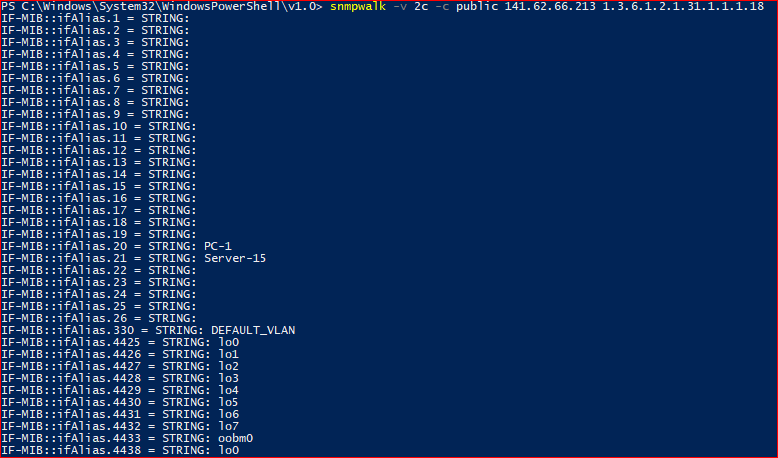
<br>
*Abbildung 11 - Aliasse der Ports an Switch 141.62.66.213*

> An Port 20 ist offensichtlich ein PC angeschlossen, an Port 21 ein Server.
>
> Es sind außerdem noch einige nicht-Ethernet Ports zu sehen, die mit Funktionen wie `loopback` oder `VLAN` beschrieben sind.

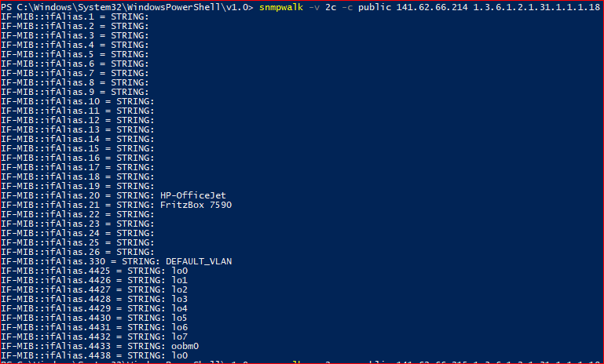
<br>
*Abbildung 12 - Aliasse der Ports an Switch 141.62.66.214*

> An Port 20 ist offensichtlich ein HP-OfficeJet Drucker angeschlossen, an Port 21 eine FRITZ!Box.

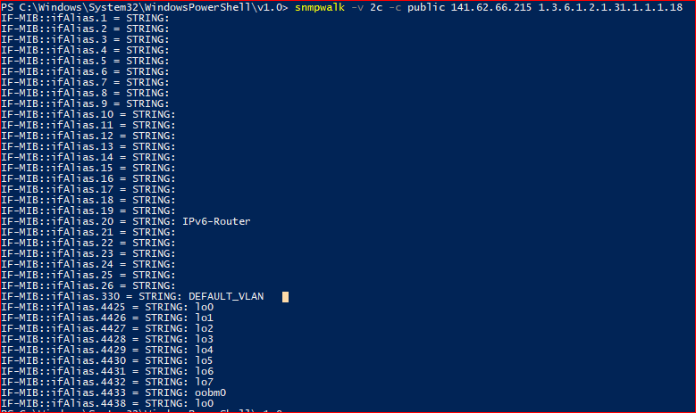
<br>
*Abbildung 13 - Aliasse der Ports an Switch 141.62.66.215*

> An Port 20 ist offensichtlich ein IPv6 Router angeschlossen.

> Bei all diesen Mutmaßungen müssen wir uns auf die Aktualität des Alias verlassen. Es ist nicht unwahrscheinlich, dass ein Port mittlerweile an
> ein anderes Gerät angeschlossen ist und der Alias nicht aktualisiert wurde. Daher sollten wir besser selbst am Switch nachgucken. :)

```
e) Gibt es Unterschiede beispielsweise zwischen PCs die angeschaltet sind und
solchen, die zwar angeschlossen, aber ausgeschaltet sind (Hinweis: Erkennbar
an der Port-Geschwindgkeit) ?
```

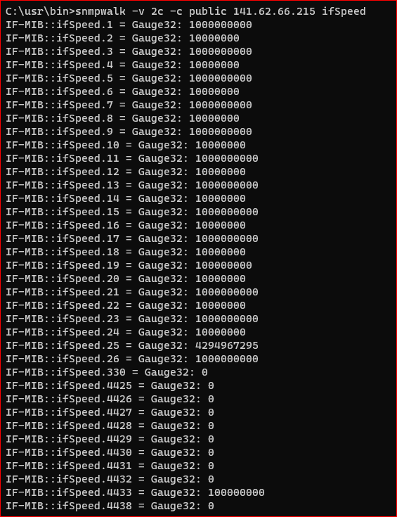
<br>
*Abbildung 14 - Unterschiede Geschwindigkeit zwischen angeschalteten und ausgeschalteten PCs*

> Ein eingeschalteter PC mit einigermaßen moderner Netzwerkkarte wird mindestens 100 Mbps per Auto-Negotiation aushandeln, noch wahrscheinlicher
> 1000 Mbps. Ein ausgeschalteter PC hingegen, der irgendeine Art von Out-of-Band Management unterstützt, wird i.d.R. eine niedrigere
> Geschwindigkeit aushandeln, da er nur wenige Pakete austauschen muss und somit Ressourcen sparen kann. Das beste Beispiel dafür ist WOL (Wake on
> LAN), welches im Ruhezustand standardmäßig mit 10 Mbps auf Pakete wartet.
>
> Ein vollständig ausgeschalteter PC ohne OOBM sollte auf `0` stehen. Solche PCs gibt es im Labor offensichtlich nicht.

```
Ab hier bitte mit Ihrem Switch (HP 2530) arbeiten.
f) Wie sieht ein entsprechender snmpwalk bei ihrem Switch aus
   (objectID: . 1.3.6.1.2.1.1)?
```

> Die OID `1.3.6.1.2.1.1` enthält mehrere MIB-Variablen, die Auskunft über allgemeine Systeminformationen wie z.B. den Namen des Geräts geben.

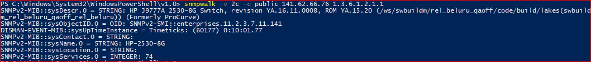
<br>
*Abbildung 15 - snmpwalk für OID 1.3.6.1.2.1.1 am eigenen Switch*

> Aus dem Screenshot wird ersichtlich, dass kein `sysContact` oder `sysLocation` konfiguriert wurde. `sysName` ist auf `HP-2530-8G` festgelegt.

```
g) Setzen Sie mit snmpset einen Ansprechparter auf ihrem Switch. Überprüfen sie
   ihre Einstellung!
```

> Um überhaupt mit `snmpset` Variablen-Werte zu ändern, mussten wir den Write Access auf dem Switch konfigurieren. Davor erhielten wir einen
> Berechtigungs-Fehler beim Ausführen von SET-commands.

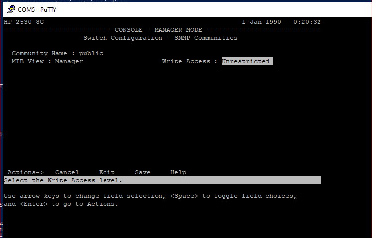
<br>
*Abbildung 16 - Setzen des SNMP Write Access auf unrestricted*

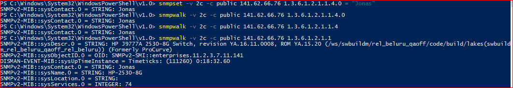
<br>
*Abbildung 17 - Setzen des Ansprechpartners vom Switch mit sysContact*

> Mithilfe der OID von `sysContact` haben wir dessen Wert auf Jonas gesetzt.
> Mit `snmpwalk` konnten wir dann wiederum überprüfen, ob der Wert tatsächlich übernommen wurde.

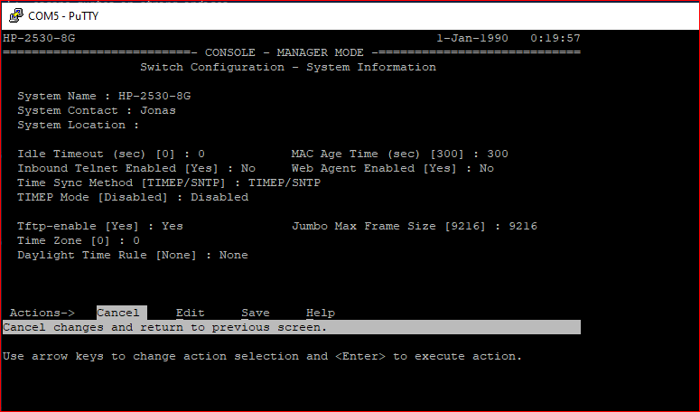
<br>
*Abbildung 18 - Überprüfung der Einstellung auch im Switch CLI Menu*

```
h) Verändern Sie mittels snmpset die Namen einzelner Switchports.
```

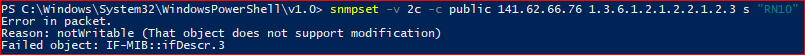
<br>
*Abbildung 19 - Versuchte Änderung des Port Namens über ifDescr*
<br>

> Wir haben initial versucht die Beschreibung des Ports mit `ifDescr` zu verändern, was nicht geklappt hat.
> Erst im Nachhinein haben wir bemerkt, dass die Interface Description meistens schreibgeschützt ist und nicht geändert werden sollte.
> Daher hätten wir stattdessen `ifAlias` mit OID `1.3.6.1.2.1.31.1.1.1.18` genutzt, um einzelnen Switch-ports einen "Namen" zu geben.
> Der richtige command wäre dann:
>> `snmpset -v 2c -c public 141.62.66.76 1.3.6.1.2.1.31.1.1.1.18.3 s "Switch Port 3"`

```
i) Unter welcher OID in der MIB wird auf Ihrem Switch der Telnet-Server aktiviert
bzw. deaktiviert.
Mit welcher OID ändern Sie die Web-Agent Idle Time?
Sie wollen dauerhaft das Webinterface auf „traditional“ setzen. Mit welcher OID?
Realisieren sie diese Teilaufgaben mit snmpset! Nutzen Sie dazu die MIB unter
https://bestmonitoringtools.com/mibdb/mibdb_search.php?mib=HP-ICF-BASIC
(Hinweis: Sie müssen bei den OIDs hinten noch eine .0 dranhängen!)
```

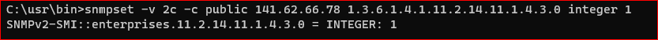
<br>
*Abbildung 20 - telnet aktiviert mit snmpset*

> Man kann telnet mit der OID `1.3.6.1.4.1.11.2.14.11.1.4.3.0` und dem entsprechenden Integer aktivieren bzw. deaktivieren.
> Der Wert `1` steht dabei für `enabled`, `2` steht für `disabled`. Die Variable heißt `hpicfTelnetEnable`.

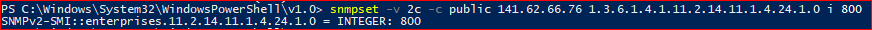
<br>
*Abbildung 21 - Setzen der Web-Agent Idle Time*

> Man kann die Web-Agent Idle Time mit der OID `1.3.6.1.4.1.11.2.14.11.1.4.24.1.0` und dem entsprechenden Wert ändern.
> Der Wert wird in Sekunden angegeben, der bei uns mit `snmpwalk` abgefragte Standard-Wert war 600 Sekunden. Die Variable heißt
> `hpicfBasicWebAgentIdleTime`.

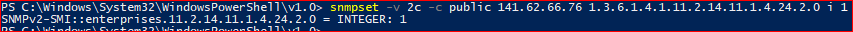
<br>
*Abbildung 22 - Setzen des Webinterface auf traditional*

> Man kann das Webinterface mit der OID `1.3.6.1.4.1.11.2.14.11.1.4.24.2.0` und dem entsprechenden Integer auf traditional bzw. improved setzen.
> Standardmäßig steht der Wert auf `2` für `improved`, mit der OID kann er auf `1` für `traditional` gesetzt werden.
> Die Variable heißt `hpicfBasicWebAgentInterface`.

```
j) Setzen Sie mit snmpset einen beliebigen Switchport auf disable (Vorsicht:
„Schneiden Sie sich nicht den Ast auf dem Sie sitzen ab!“)
```

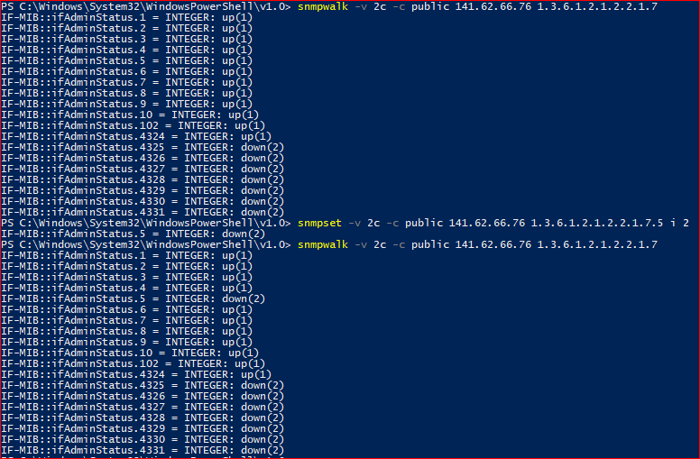
<br>
*Abbildung 23 - Port 5 deaktiviert mit snmpset und überprüft mit snmpwalk*

> Die Ports lassen sich mit der OID `1.3.6.1.2.1.2.2.1.7.{PORT INDEX}` und entsprechendem Integer aktivieren bzw. deaktivieren.
>
> Hierbei bedeutet der Wert `1` den Status `up` (aktiviert), `2` steht für `down` (deaktiviert).
> Wir haben erfolgreich Port 5 deaktiviert und konnten dies zusätzlich zu `snmpwalk` auch im CLI Menu des Switches überprüfen.

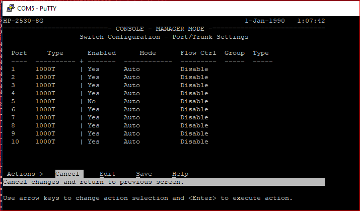
<br>
*Abbildung 24 - Überprüfung des deaktivieren Ports im CLI Menu*

```
k) Wie ändert man den System-Namen des Switches?
```

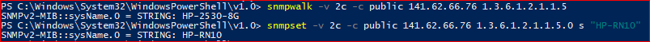
<br>
*Abbildung 25 - Überprüfen und ändern des sysName*

> Der Systemname lässt sich mit der OID `1.3.6.1.2.1.1.5.0` und dem entsprechenden String ändern.
>
> Wir haben erfolgreich den `sysName` auf `HP-RN10` angepasst. Auch dies ließ sich zusätzlich wieder über das CLI Menu überprüfen.

# 2. Aufgabe - Prometheus und Grafana

# Aufgabe 2.1 - Prometheus

```
a) Fragen Sie mit Prometheus den sysName ihres Switches ab.
   sysName{display=“<node>“}
```

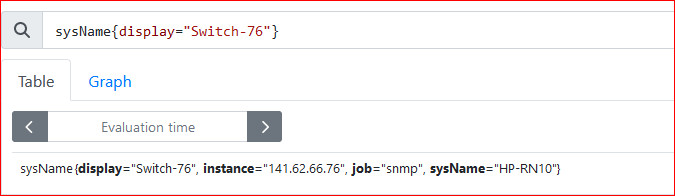<br>
*Abbildung 26 - Name des Switch über Prometheus*<br>

> Die Abfrage der MIB-Variable `sysName` über SMTP mithilfe von Prometheus ergab den von uns vorher bereits geänderten Systemname `HP-RN10`.

```
b) Wie lange läuft Ihr Switch bereits?
```

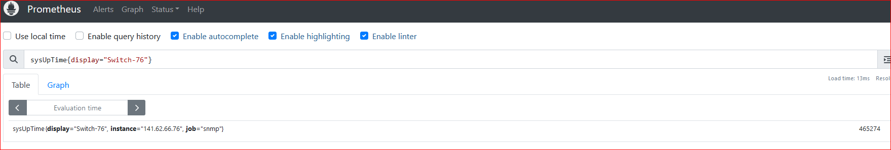<br>
*Abbildung 27 - Uptime des Switch über Prometheus*<br>

> Die uptime lässt sich über die MIB Variable `sysUpTime` abfragen.
>
> In unserem Fall gab die query den Wert `465274` zurück. Der Befehl gibt die Uptime in Hundertstelsekunden an, durch Teilung durch 100 `465274 /
> 100 = 4652,74` erhält man den Wert in Sekunden. Dann noch geteilt durch 60 `4653 / 60 = 77,55` und man erhält eine Uptime von ca. 77 1/2 Minuten,
> also ungefähr 1 Stunde und 17 Minuten.

```
c) Sind alle Switchports „UP“?
```

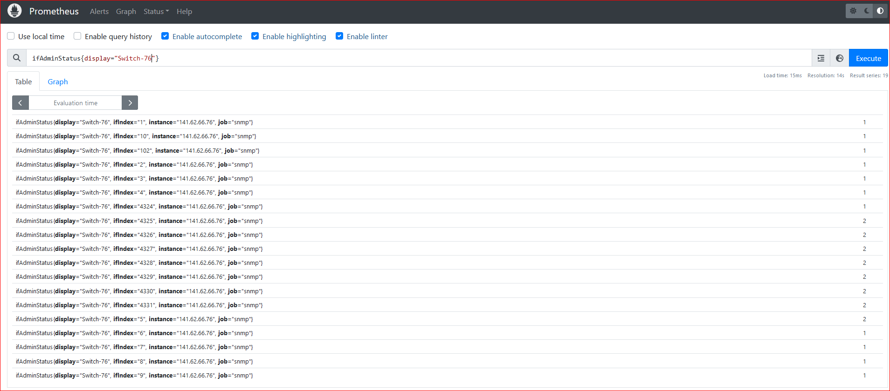<br>
*Abbildung 28 - Abfrage der Port Status über Prometheus*<br>

> Die Ports des Switches können mit `ifAdminStatus` nach ihrem Zustand gefragt werden.
>
> In der Antwort findet man den jeweiligen Port durch den `ifIndex`. Am Ende der Zeile steht der Statuscode, wobei `1` für `up` steht und `2` für
> `down`. Wie im Screenshot zu sehen, waren alle unsere physischen Ports `up`, bis auf Port 5, der in einer vorigen Aufgabe deaktiviert wurde. Bei den
> anderen Ports handelt es sich um logische / virtuelle Ports wie z.B. für loopback oder VLAN, diese sind aber größtenteils down.

```
d) Mit welchem Speed laufen ihre Switchports
   ifSpeed{……}
```

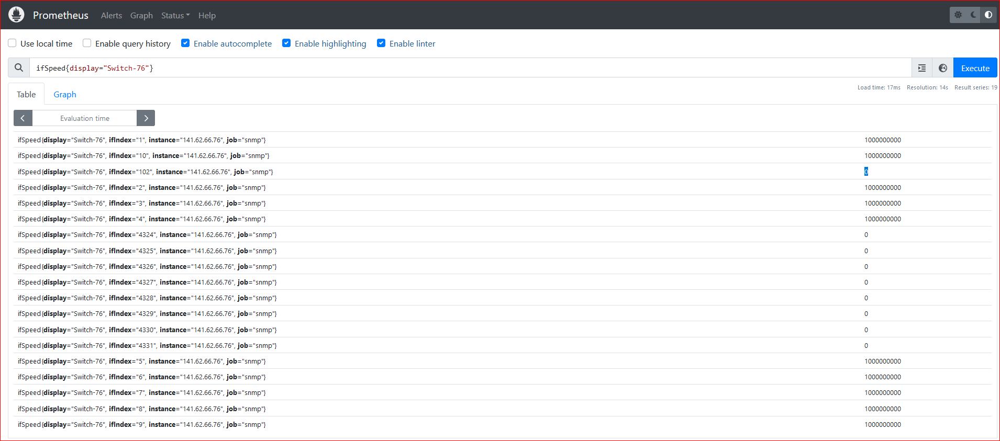<br>
*Abbildung 29 - Geschwindigkeit der Ports über Prometheus*<br>

> Die Geschwindigkeiten der Ports können mit `ifSpeed` abgefragt werden.
>
> Auch hier gibt es wieder einen `ifIndex` für den entsprechenden Port, sowie den tatsächlichen Wert des Ports am Ende der Zeile. Die Variable gibt
> die ausgehandelte (maximale) Geschwindigkeit der Ports in Bits pro Sekunde (bps) an. In unserem Fall liefen alle physischen Ports mit `1 000 000
> 000 bps` also
> 1000 Mbps oder auch 1 Gbps. Hierbei ist zu beachten, dass es sich um die im Moment maximal mögliche Geschwindigkeit des Ports handelt, nicht die
> aktuelle Übertragungsrate. Sollte ein Gerät an einen Port angeschlossen werden, das diese Geschwindigkeit nicht unterstützt, würde die
> Geschwindigkeit des Ports per Auto-Negotiation herabgesetzt werden.

```e) Über wie viele Ethernet-Interfaces verfügt ihr Switch?```

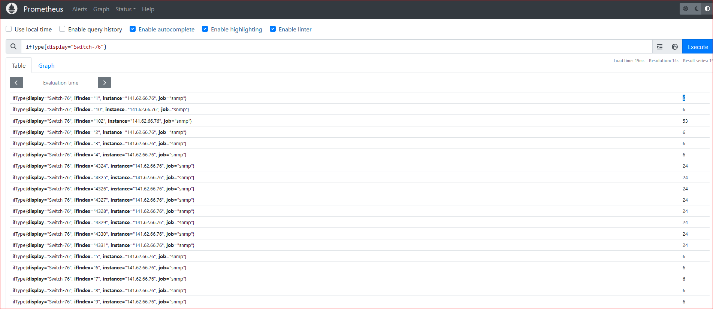<br>
*Abbildung 30 - Arten der Ports über Prometheus*<br>

> Die Anzahl der Ethernet-Interfaces kann ermittelt werden, indem mit `ifType` die Art des jeweiligen Interface abgefragt wird.
>
> Die Abfrage gibt dabei einen numerischen Wert zurück, der für verschiedene Arten von Interfaces steht. In der Dokumentation der `ifType`
> MIB Variable findet man die Bedeutung der Codes, wobei Code `6` für Ethernet mit CSMA/CD steht. In unserem Fall sind wie erwartet 10 Ports mit
> Code 6 zurückgegeben worden.

# Aufgabe 2.2 - Grafana

```
Legen Sie sich zunächst ein eigenes Dashboard (entsprechend ihrem Switch-Namen)
an, damit Sie niemandem in die Quere kommen.
Über den Graphen-Titel kommen Sie mit Links-Klick in den Edit-Bereich. Anschließend
lassen sich im unteren Bereich über „Metrics Browser“ die Abfragen generieren.
Schauen sie sich die zwei Vorlagen “Vorlage Praktikum“ und „SNMP Interface
Throughput“ an.
a) Stellen Sie IN und OUT eines Switchports mit einem sinnvollen Graphen dar.
```

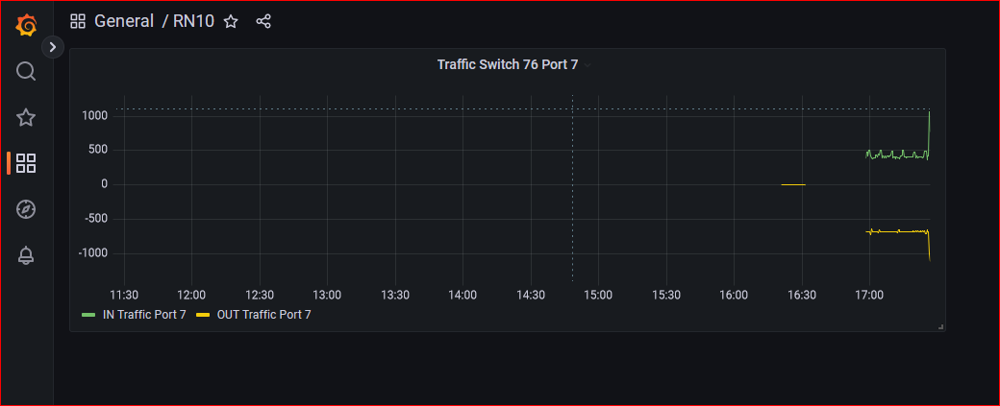
<br>
*Abbildung 31 - Grafana-Graph für Port Traffic*

> Der Graph zeigt den ein- und ausgehenden Traffic auf Switch-Port 7 (Gerät: Labor-PC) in kbps zu verschiedenen Zeitpunkten an. Auffällig ist
> hierbei der abrupte Anstieg, im Bild ganz rechts zu sehen. Dies ist zum Beispiel gegeben durch das Laden einer Webseite oder anderer Erzeugung
> von Traffic.

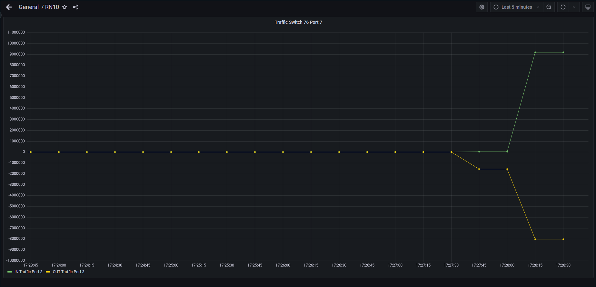
<br>
*Abbildung 32 - Port Traffic Graph detaillierte Ansicht*

> In Abbildung 32 sieht man eine zweite Ansicht des Traffic-Graphen, der die Aktivität detaillierter darstellt. Auch hier sieht man wieder 
> einen starken Anstieg, zusätzlich hatten wir hier noch einen Speedtest gestartet. Mithilfe dieser Ansicht können sowohl sehr große als auch
> kleine Datendurchsätze einfach erkannt werden.

# Für die restlichen Aufgaben blieb leider keine Zeit mehr, Aufgabe 3 konnte nur angeschnitten werden.
