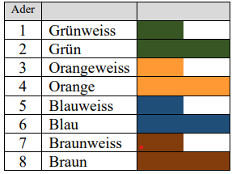
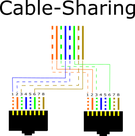
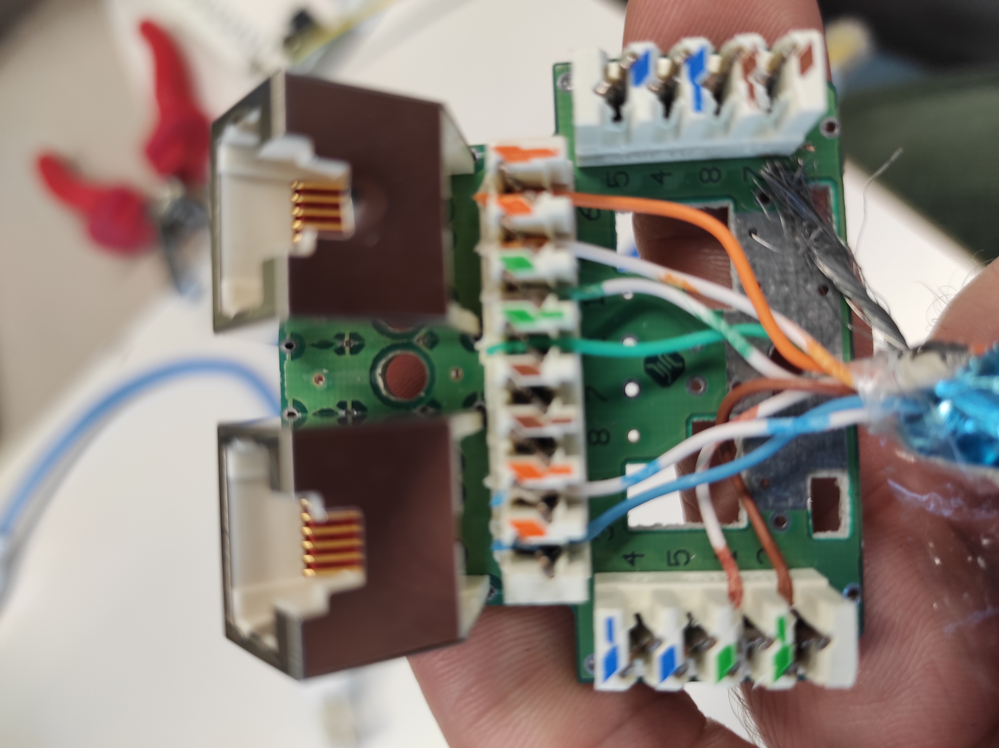
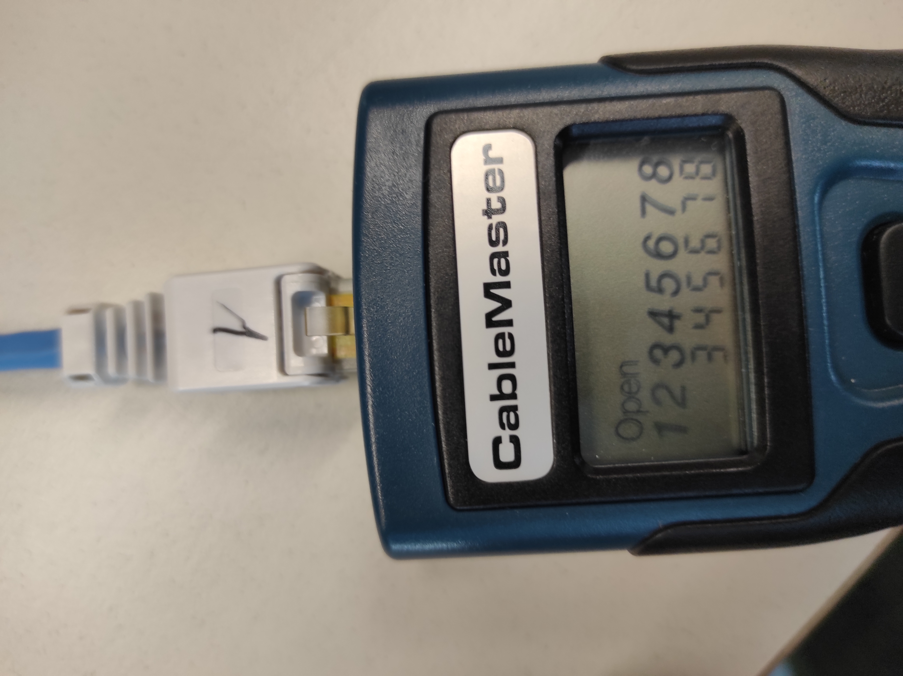
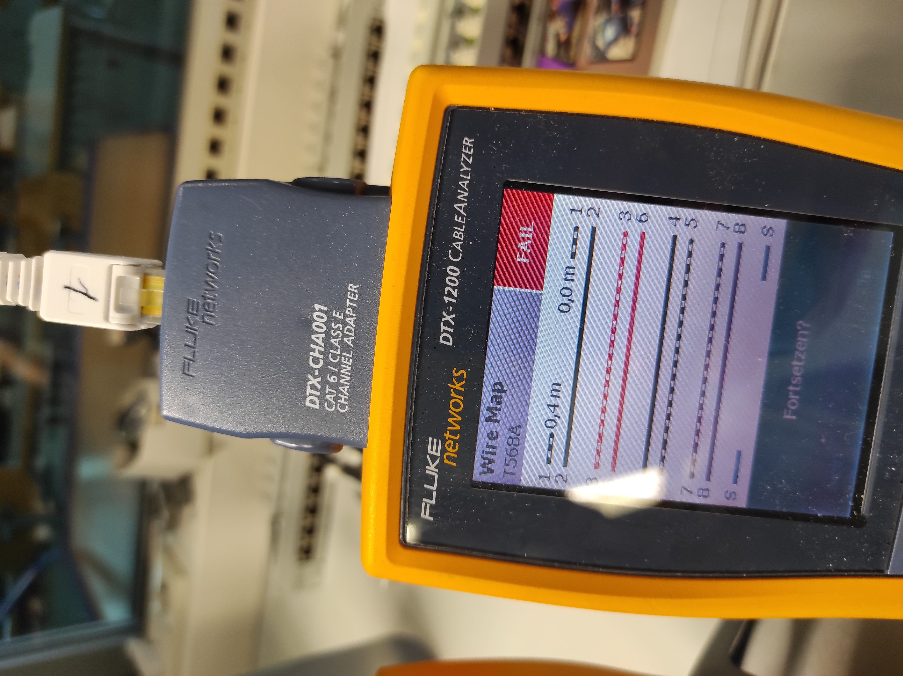
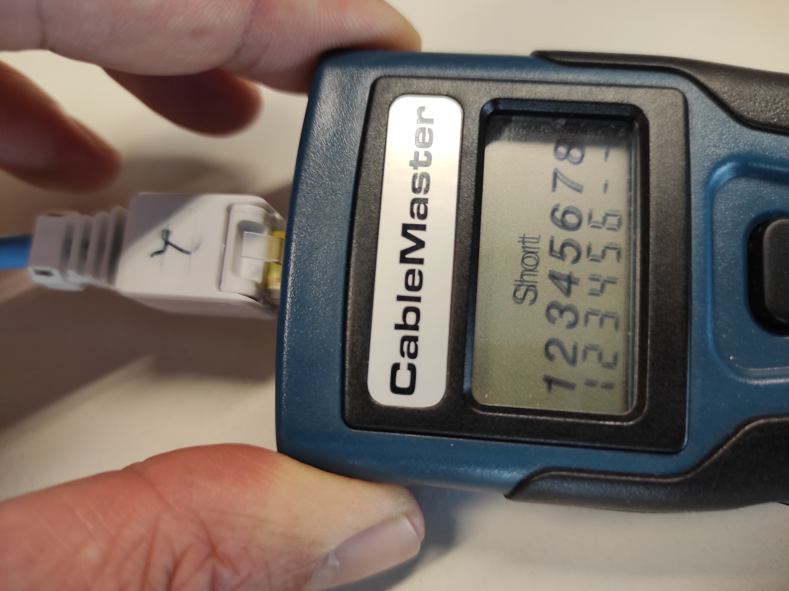
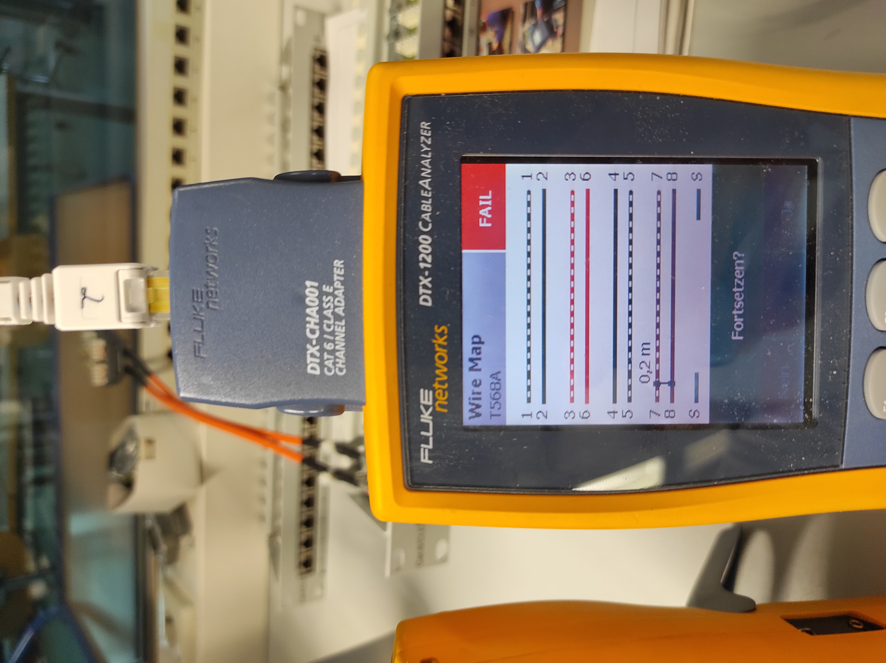
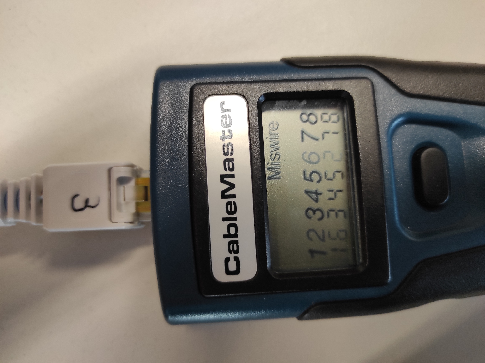
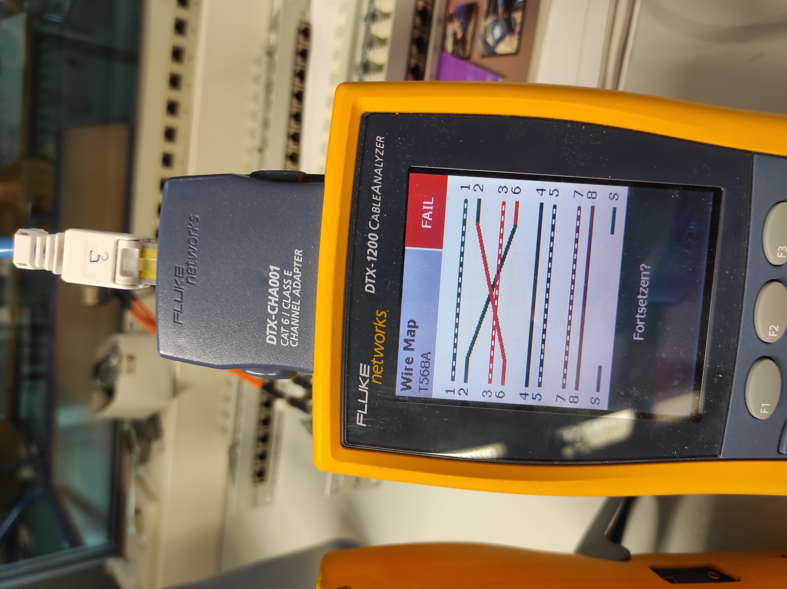

<div style="page-break-after: always;">
<center>
<span style="font-size: 20pt">
Praktikum Rechnernetze SS23 <br> Versuch 9: Verkabelung <br> Gruppe 4 <br>
</span>
<br>
<span style="font-size: 11pt">
Versuch durchgeführt: 20.06.2023 <br>
HdM Stuttgart<br><br>
Gruppe 4 Mitglieder:
 <br> Fabian Weber – fw072
 <br> Darius Patzner – dp047
 <br> Jonas Gehrung – jg175
 <br> Adib Shaqaiq – as448
 <br> Jonas Öhler – jo041
 <br>
 <br> Labor-PCs 141.62.66.9 und 141.62.66.10 wurden während dieses Versuchs benutzt
</span>
</center>

</div>

# Aufgabe 1 - Teil 1: Elektrische Verkabelung

## Aufgabe 1.1

```
a)
Die wichtigsten technischen Größen eines Kabels sind die Werte für die Impedanz, die 
Dämpfung, für das Nebensprechen und das sich daraus zu errechnende ACR. 
Wie ist der ACR-Wert definiert?  
```

> ACR steht für Attenuation-to-Crosstalk Ratio, dabei handelt es sich um einen dB Wert, der allgemein das Verhältnis zwischen der Dämpfung
> (Attenuation) und dem Nebensprechen (Cross-Talk) angibt.
>
> Der interessanteste Cross-Talk Wert ist dabei i.d.R. der Near-End Cross-Talk (NEXT) Wert.
>
> Um den ACR zu berechnen, wird die Dämpfung in dB sowie der NEXT-Wert in dB benötigt. Dann kann der ACR-Wert mit folgender Gleichung berechnet
> werden:
>> `ACR = NEXT - Dämpfung`

```
b)
Sollte er hoch oder niedrig sein. Was kann ein ACR-Wert bewirken, der außerhalb der 
Toleranz liegt.
```

> Generell bedeutet ein positiver ACR-Wert, dass die Signalstärke stärker als das Nebensprechen ist.
> Ein möglichst hoher ACR-Wert ist also von Vorteil und signalisiert eine bessere Qualität der Übertragungsstrecke im Vergleich zu einem
> niedrigeren ACR-Wert.
>
> Ein ACR-Wert der außerhalb der genormten ACR-Grenzwerte liegt, könnte auf ein beschädigtes oder qualitativ minderwertiges Kabel hindeuten. Aber
> auch die Verwendung eines Kabels außerhalb seiner Spezifikationen wie z.B. über die maximale Länge hinaus, oder in Bereichen mit starken externen
> Störfaktoren, können den ACR-Wert zum schlechten Verändern. Die Folge können verschiedenste Probleme wie z.B. verringerte Bandbreite, erhöhte
> Fehlerrate oder sogar Totalausfall sein.

```
c)
Welche weiteren Werte können zur Kabelqualifizierung herangezogen werden?
```

> Es gibt noch viele weitere Werte zur Qualifizierung von Kabeln, hier sind noch ein paar Wichtige:
> - Transferimpedanz für die Qualifizierung der Schirmung (in Ohm, niedriger ist besser)
> - Weitere Arten von Cross-Talk-Werten wie z.B. ELFEXT (Equal-Level Far-End Crosstalk)
> - Delay Skew zur Messung der Zeitdifferenz für Signale auf verschiedenen Aderpaaren, hoher Wert bedeutet unsynchrone Signale

## Aufgabe 1.2

```
Erläutern Sie mit wenigen Worten den Begriff der „strukturierten Verkabelung“. 
```

> Bei der Planung von Gebäuden und wie diese vernetzt werden sollen ist ein durchdachtes und einheitliches Konzept wichtig.
> Dabei sollen die Normen für die strukturierte Verkabelung helfen, diese bieten einen standardisierten und einheitlichen Aufbauplan für eine
> multifunktionsfähige Netzwerkinfrastruktur.

## Aufgabe 1.3

```
Sie finden an einem Patchfeld oder einer Dose folgende Gigabit-Verbindung vor:
```



```
a)
Warum könnte ein derartiges Kabel Probleme verursachen und welche?
```

> Nach Übertragungsstandard werden die Adernpaare 3+6 und 4+5 miteinander verbunden.
> Da jeweils 2 Pare für den Empfang und 2 Paare für das Senden von Daten genutzt werden, müssen die Paare symmetrisch angeordnet werden, um 
> gegenseitige Störungen möglichst zu vermeiden.
>
> Allerdings weicht dieses spezielle Kabel von der üblichen Verdrahtung ab, indem es die Adern 3+4 und 5+6 miteinander verdrillt. Diese Abweichung hat
> zur Folge, dass die Symmetrie nicht gegeben ist. Dadurch kann das Signal anfälliger für Störungen werden und die Übertragung kann verfälscht werden.
> Sollte zusätzlich an das Patchfeld angeschlossene Geräte die reguläre Verkabelung nach Norm besitzen (TIA-568B), könnte dies zu erheblichen 
> Problemen in der Übertragung führen und würde eine Gigabit-Verbindung deutlich erschweren.

```
b)
Warum müssen eigentlich alle 8 Adern (=4 Paare) angeschlossen sein? 
(Stichwort: 4D-PAM5)
```

> Wenn nicht alle 8 Adern angeschlossen sind, würde dies bedeuten, dass nicht alle 4 Paare für die Datenübertragung genutzt werden können. Dadurch 
> würde die Anzahl der übertragbaren Datensymbole reduziert, was zu einer geringeren Datenkapazität führt. Dies kann die maximale Datenrate und die
> Leistungsfähigkeit der Ethernet-Verbindung beeinträchtigen, Gigabit-Verbindungen sind generell aber nicht nur über 4 Paare möglich.
>
> Es ist dennoch wichtig, alle 8 Adern in einem Ethernet-Kabel anzuschließen, um die volle Unterstützung des 4D-PAM5 Modulationsverfahrens und die
> maximale Datenkapazität zu gewährleisten, sowie um sich an den Standard zu halten und Kompatibilität zu gewährleisten.

```
c)
Wieso gibt es 2 Standards für die Kontaktierung von achtpoligen RJ-45-Steckern und 
Buchsen?
```

> Ursprünglich wurden diese Standards in Nordamerika entwickelt, um die Verkabelung in Telefonnetzwerken zu standardisieren.
> Später wurden sie auch für die Ethernet-Verkabelung übernommen. Daraus entstanden zwei Standards mit unterschiedlichen Anwendungen.
>
> Der Hauptunterschied zwischen den beiden Standards liegt in der Belegung der Adernpaare. Beim TIA/EIA-568A-Standard wird das Adernpaar 1 auf Pins 3
> und 6 kontaktiert, während das Adernpaar 2 auf Pins 1 und 2 liegt. Beim TIA/EIA-568B-Standard hingegen wird das Adernpaar 1 auf Pins 4 und 5
> kontaktiert, und das Adernpaar 2 auf Pins 7 und 8.
>
> Die Existenz von zwei Standards ermöglicht eine gewisse Flexibilität und Kompatibilität bei der Verkabelung. Es gibt Situationen, in denen es
> erforderlich sein kann, verschiedene Standards zu verwenden, beispielsweise wenn vorhandene Installationen bereits nach einem bestimmten Standard
> verdrahtet sind. Durch die Bereitstellung von zwei Standards können diese bestehenden Verkabelungen weiterhin genutzt werden, und es besteht die
> Möglichkeit, zwischen den Standards zu konvertieren, wenn erforderlich.
>
>Es ist jedoch wichtig zu beachten, dass für eine ordnungsgemäße Verbindung immer beide Seiten (Stecker und Buchse) mit demselben Standard verdrahtet
> sein müssen. Die Wahl zwischen TIA/EIA-568A und TIA/EIA-568B sollte basierend auf den spezifischen Anforderungen eines Netzwerks und der
> Kompatibilität mit vorhandenen Installationen getroffen werden.

# Aufgabe 1 - Teil 2: Optische Verkabelung

# Aufgabe 1.4

```
Welche Messgrößen sind bei einem optischen Kabel im Vergleich zu den Messgrößen 
eines elektrischen Kabels sinnvoll?
```

> * Modendispersion: Gibt die zeitliche Ausbreitungsdifferenz an, die dadurch entsteht, dass ein optischer Puls über verschiedene Moden übertragen
    wird, die jeweils unterschiedliche Strecken zurücklegen und dadurch unterschiedliche Laufzeiten haben.
> * Chromatische Dispersion: Gibt die Ausbreitungverzögerung von verschiedenen Wellenlängen an, die durch unterschiedliche Geschwindigkeiten der
    verschiedenen Wellenlängen entstanden sind.
> * Polarisationsmodendispersion: Misst die Auswirkungen von Polarisationsschwankungen auf einem Signal, die durch unterschiedliche Polarisation des
    Lichts entsteht.
> * Reflektionsdämpfung
    Misst die Stärke der reflektierten Signale an den Übergängen zwischen verschiedenen Kabeln.

# Aufgabe 1.5

```
a)
Was ist ein OTDR (zur Qualifizierung optischer Verbindungen)? 
```

> Ein OTDR (Optical Time Domain Reflectometer) ist ein Gerät, das verwendet wird, um optische Verbindungen in Glasfaserkabeln zu überprüfen. Es misst
> die Qualität und Leistungsfähigkeit dieser Verbindungen.

```
b)
Wozu wird es benötigt?
Das Internet freut sich auf Ihren Besuch
```

> Ein OTDR wird benötigt, um Probleme in Glasfaserkabeln zu erkennen. Das Gerät sendet Lichtimpulse in die Glasfaser und analysiert, wie das Licht
> zurückgestreut wird. Dadurch kann es feststellen, ob es Dämpfungsverluste gibt, bei denen das Licht schwächer wird, oder Reflexionen, bei denen das
> Licht zurückgeworfen wird.

# Die zweite Aufgabe war für die Messtechniker

# Aufgabe 3

# Aufgabe 3.1

```
a)
Schließen Sie eine RJ-45 Anschlussdose an das zur Verfügung gestellte Patchfeld an (kurzes 
orangenes Kabel von der Rolle abschneiden). Damit simulieren sie eine Verbindung, die 
üblicherweise von einem Systemschrank bis zur RJ45-Dose am Arbeitsplatz besteht.
Am Arbeitsplatz liegt entsprechendes Werkzeug. Lassen Sie sich vom Betreuer u. U. die 
Funktion des LSA-Werkzeuges erklären. 

Welche zwei Anschlussmöglichkeiten (lt. Norm) haben sie für den Anschluss einer 
Dose?
Achtung: Das Kabel kann seine Funktion bei 1000 Mbit/s nur erfüllen, wenn Sie peinlichst genau auf 
die maximal zulässige unverdrillte Kabellänge achten!
```

> Man unterscheidet zwischen den beiden Anschlussmöglichkeiten TIA 568A und TIA 568B. Diese Standards unterscheiden sich in iherer
> Verdrahtungsreihenfolge.
> * TIA 568A:
> 1. Weißes/Grün
> 2. Grün
> 3. Weißes/Orange
> 4. Blau
> 5. Weißes/Blau
> 6. Orange
> 7. Weißes/Braun
> 8. Braun
> * TIA 568B:
> 1. Weißes/Orange
> 2. Orange
> 3. Weißes/Grün
> 4. Blau
> 5. Weißes/Blau
> 6. Grün
> 7. Weißes/Braun
> 8. Braun

```
b)
Wie lang darf die unverdrillte Kabelstrecke im Patchfeld und in der Dose sein?
ChatGPT antwortet dazu: „Gemäß den Standards von TIA/EIA und ISO/IEC darf die 
unverdrillte Kabellänge bei CAT6 nicht mehr als 20 Meter betragen. Dies bedeutet, 
dass die maximale Länge des horizontalen Kabelsegments zwischen dem Patchpanel 
und der Netzwerkdose oder dem Endgerät 90 Meter nicht überschreiten sollte. Die 
restlichen 10 Meter sind für die Patchkabel an den Enden des horizontalen 
Kabelsegments vorgesehen. Es ist wichtig, diese Vorgaben einzuhalten, um eine 
korrekte Signalübertragung und eine maximale Leistung des Netzwerks zu 
gewährleisten.“ Das ist allerdings nicht richtig.
```

> Die Länge der unverdrillten Kabelstrecke im Patchfeld und in der Dose sollte nicht mehr als 13 mm (0,5 Zoll) betragen, um Störungen und
> Signalverluste zu minimieren.

# Aufgabe 3.2

```
a)
Was versteht man unter „CableSharing“? 
Realisieren Sie solch eine Verbindung (Patchfeld -> Dose) und dokumentieren Sie 
Ihre Messergebnisse! 
```


<br>
*Abbildung 1 - Cable-Sharing grafisch dargestellt*<br>


<br>
*Abbildung 2 - Cable-Sharing in der Praxis*<br>

> Unter Cable-Sharing versteht man die Nutzung ungenutzter Adern eines Kabels für eine zweite Netzwerkverbindung. Das heißt, es werden mit einem
> 8-adrigen Kabel zwei Netzwerkdosen angeschlossen.
> Bei der Verwendung von Cable-Sharing ist allerdings nur noch eine Verbindung von 100 Mbit/s möglich.
> Um Cable-Sharing umzusetzen, werden für eine Dose Paar 1 und Paar vier angeschlossen und für die andere Dose Paar 2 und Paar 3 angeschlossen (Siehe
> Abbildung 1 und 2 - Realisierung von Cable-Sharing als Grafik und in der Realität).
> Cable Sharing war ehemals ein Standard, der unter der Nummer EN 50173 geführt wurde. Er wurde jedoch wieder abgeschafft,
> da es mit der Versorgung von Ethernetgeräten des Standards 802.3af kollidiert.
> Leider hatten wir keine Zeit mehr um Messungen durchzuführen.

```
b)
Warum kann man mit CableSharing keine Gigabit-Anbindung realisieren?
```

> Mit Cable-Sharing kann keine Gigabit-Verbindung realisiert werden, da Gigabit-Ethernet alle 8 Adern benötigt uum eine Verbindung aufzubauen.

# Aufgabe 3.3

```
Ihnen stehen 3 blaue Kabel zur Verfügung, die unterschiedliche Fehler aufweisen. 

a)
Messen sie diese Kabel mit ihrem CM200-Messgerät durch. Dokumentieren Sie die 
Messergebnisse.
```

> 
>
>Abbildung 3: Kabel 1 am CM200
>
>Auf dem Messgeraet CM200 konnten wir sehen, dass die Adern 1 und 2 nicht verbunden sind. Eine genauere Analyse bei der Gruppe "Messtechnik" lieferte
> wie im unten angefügten Bild zu sehen die Information, dass die Ader 2 tatsächlich doch verbunden ist, die 1. Ader jedoch nicht. Ausserdem scheint der
> Schirm des Kabels nicht intakt zu sein.
>
>
>
>Abbildung 4: Kabel 1 am DTX-1200
>
>
>
>Abbildung 5: Kabel 2 am CM200
>
>Bei dem zweiten Kabel lässt sich auf dem CM200 schon ein Kurzschluss erkennen zwischen den Adern 7 und 8.
>
>
>
>Abbildung 6: "Kurzschluss" Kabel 2 am DTX-1200
>
>Am DTX-1200 bestätigt sich das Ergebnis des CM200, der Kurzschluss ist zwischen Adern 7 und 8, womöglich aufgrund einer beschädigten oder fehlenden
> Isolierung.



> Abbildung 7: Kabel 3 am CM200

Kabel 3 hat ein anderes Problem und zwar sind die Adern 2 und 6 jeweils an den falschen Eingang/Ausgang angeschlossen. Es handelt sich schlicht um
eine falsche Verkabelung (engl. Miswire). Auf beiden Geräten ist diese fehlerhafte Verkabelung gut zu erkennen.



> Abbildung 8: "Miswire" Kabel 3 am DTX-1200

```
b)
Können Sie bei Verwendung von Kabel 2 mittels JPerf die Übertragungsrate messen?
```

> Nein, das ist nicht möglich, da das Kabel einen Kurzschluss hat zwischen den Adern 7 und 8 wie oben schon beschrieben. Es werden keine Daten über
> das Kabel übertragen, somit kommt auch keine messbare Uebertragunsrate zu stande.

# Für Aufgabe 3.4 sowie 3.1 c-f hat uns leider die Zeit gefehlt.